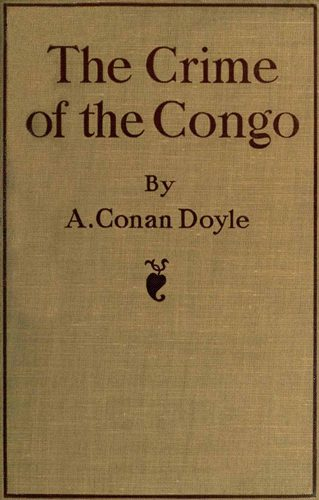

The high hopes which the advent of the Commission raised among the natives and the few Europeans who had acted as their champions, were soon turned to bitter disappointment. The indefatigable Mr. Harris had sent on after the Commission a number of fresh cases which had come to his notice. In one of these a chief deposed that he had been held back in his village (Boendo) in order to prevent him from reaching the Commission. He succeeded in breaking away from his guards, but was punished for his enterprise by having his wife clubbed to death by a sentry. He brought with him, in the hope that he might lay them before the judges, one hundred and eighty-two long twigs and seventy-six smaller ones, to represent so many adults and children who had been murdered by the A.B.I.R. Company in his district during the last few years. His account of the methods by which these unfortunate people met their deaths will not bear printing. The wildest dreams of the Inquisition were outdone. Women had been killed by thrusting stakes into them from below. When the horrified missionary asked the chief if this was personally known to him, his answer was, "They killed my daughter, Nsinga, in this manner; I found the stake in her." And a reputable Belgian statesman can write in this year of grace that they are carrying on the beneficent and philanthropic mission which has been handed down to them.

\[caption id="attachment\_1093" align="alignright" width="319"\] [Buy this book from Amazon](http://www.amazon.com/gp/product/1434436179/ref=as_li_ss_tl?ie=UTF8&camp=1789&creative=390957&creativeASIN=1434436179&linkCode=as2&tag=sirconandoyle-20)\[/caption\]

In a later communication Mr. Harris gives the names of men, women and children killed by the sentries of a M. Pilaet.

> "Last year," he says, "or the year before, the young woman, Imenega, was tied to a forked tree and chopped in half with a hatchet, beginning at the left shoulder, chopping down through the chest and abdomen and out at the side." Again, with every detail of name and place, he dwelt upon the horrible fact that public incest had been enforced by the sentries—brother with sister, and father with daughter. "Oh, Inglesia," cried the chief in conclusion, "don't stay away long; if you do, they will come, I am sure they will come, and then these enfeebled legs will not support me, I cannot run away. I am near my end; try and see to it that they let me die in peace; don't stay away."
> 
> "I was so moved, your Excellency, at these people's story that I took the liberty of promising them, in the name of the Congo Free State, that you will only kill them in future for crimes. I told them the Inspector Royal was, I hoped, on his way, and that I was sure he would listen to their story, and give them time to recover themselves."

It is terrible to think that such a promise, through no fault of Mr. Harris, has not been fulfilled. Are the dreams of the Commissioners never haunted by the thought of those who put such trust in them, but whose only reward has been that they have been punished for the evidence they gave and that their condition has been more miserable than ever. The final practical result of the Commission was that upon the natives, and not upon their murderers, came the punishment.

M. Malfeyt, a Royal High Commissioner, had been sent out on pretence of reform. How hollow was this pretence may be seen from the fact that at the same time M. Wahis had been despatched as Governor-General in place of that Constermann who had committed suicide after his interview with the judges of the Commission. Wahis had already served two terms as Governor, and it was under his administration that all the abuses the Commission had condemned had actually grown up. Could King Leopold have shown more clearly how far any real reform was from his mind?

M. Malfeyt's visit had been held up as a step toward improvement. The British Government had been assured that his visit would be of a nature to effect all necessary reforms. On arriving in the country, however, he announced that he had no power to act, and only came to see and hear. Thus a few more months were gained before any change could be effected. The only small consolation which we can draw from all this succession of impotent ambassadors and reforming committees, which do not, and were never intended to, reform, is that the game has been played and exposed, and surely cannot be played again. A Government would deservedly be the laughing-stock of the world which again accepted assurances from the same source.

What, in the meanwhile, was the attitude of that A.B.I.R. Company, whose iniquities had been thoroughly exposed before the Commission, and whose manager M. Le Jeune, had fled to Europe? Was it ashamed of its bloodthirsty deeds? Was it prepared in any way to modify its policy after the revelations which its representatives had admitted to be true? Read the following interview which Mr. Stannard had with M. Delvaux, who had visited the stations of his disgraced colleague:

> "He spoke of the Commission of Inquiry in a contemptuous manner, and showed considerable annoyance about the things we had said to the Commission. He declared the A.B.I.R. had full authority and power to send out armed sentries, and force the people to bring in rubber, and to imprison those who did not. A short time ago, the natives of a town brought in some rubber to the agent here, but he refused it because it was not enough, and the men were thrashed by the A.B.I.R. employees, and driven away. The director justified the agent in refusing the rubber because the quantity was too small. The Commissioners had declared that the A.B.I.R. had no power to send armed sentries into the towns in order to flog the people and drive them into the forests to seek rubber; they were 'guards of the forest,' and that was their work. When we pointed this out to M. Delvaux, he pooh-poohed the idea, and said the name had no significance; some called the sentries by one name, some by another. We pointed out that the people were not compelled to pay their taxes in rubber only, but could bring in other things, or even currency. He denied this, and said that the alternative tax only meant that an agent could impose whatever tax he thought fit. It had no reference whatever to the natives. The A.B.I.R. preferred the taxes to be paid in rubber. This is what the A.B.I.R. says, in spite of the interpretation by Baron Nisco, the highest judicial authority in the State, that the natives could pay their taxes in what they were best able. All these things were said in the presence of the Royal High Commissioner, who, whether he approved or not, certainly did not contradict or protest against them."

Within a week or two of the departure of the Commission the state of the country was as bad as ever. It cannot be too often repeated that it was not local in its origin, but that it occurred there, as elsewhere, on account of pressure from the central officials. If further proof were needed of this it is to be found in the Van Caelchen trial. This agent, having been arrested, succeeded in showing (as was done in the Caudron case) that the real guilt lay with his superior officers. In his defence he

> "Bases his power on a letter of the Commissaire-Général de Bauw (the Supreme Executive Officer in the District), and in a circular transmitted to him by his director, and signed 'Constermann' (Governor-General), which he read to the Court, deploring the diminished output in rubber, and saying that the agents of the A.B.I.R. should not forget that they had the same powers of '_contrainte par corps_' (bodily detention) as were delegated to the agent of the Société Commerciale Anversoise au Congo for the increase of rubber production; that if the Governor-General or his Commissaire-Général did not know what they were writing and what they signed, he knows what orders he had to obey; it was not for him to question the legality or illegality of these orders; his superiors ought to have known and have weighed what they wrote before giving him orders to execute; that bodily detention of natives for rubber was no secret, seeing that at the end of every month a statement of '_contrainte par corps_' (bodily detention) during the month has to be furnished in duplicate, the book signed, and one of the copies transmitted to the Government."

Whilst these organized outrages were continuing in the Congo, King Leopold, at Belgium, had taken a fresh step, which, in its cynical disregard for any attempt at consistency, surpassed any of his previous performances. Feeling that something must be done in the face of the finding of his own delegates, he appointed a fresh Commission, whose terms of reference were "to study the conclusions of the Commission of Inquiry, to formulate the proposals they call for, and to seek for practical means for realizing them." It is worth while to enumerate the names of the men chosen for this work. Had a European Areopagus called before it the head criminals of this terrible business, all of these men, with the exception of two or three, would have been standing in the dock. Take their names in turn: Van Maldeghem, the President—a jurist, who had written on Congo law, but had no direct complicity in the crimes; Janssens, the President of the former Commission, a man of integrity; M. Davignon, a Belgian politician—so far the selection is a possible one—now listen to the others! De Cuvelier, creature of the King, and responsible for the Congo horrors; Droogmans, creature of the King, administrator of the secret funds derived from his African estates, and himself President of a Rubber Trust; Arnold, creature of the King; Liebrechts, the same; Gohr, the same; Chenot, a Congo Commissioner; Tombeur, the same; Fivé, a Congo inspector; Nys, the chief legal upholder of the King's system; De Hemptinne, President of the Kasai Rubber Trust; Mobs, an Administrator of the A.B.I.R. Is it not evident that, save the first three, these were the very men who were on their trial? The whole appointment is an example of that cynical humour which gives a grotesque touch to this inconceivable story. It need not be added that no result making for reform ever came from such an assembly. One can but rejoice that the presence of the small humane minority may have prevented the others from devising some fresh methods of oppression.

It cannot be said, however, that no judicial proceedings and no condemnation arose from the actions of the Congo Commission. But who could ever guess who the man was who was dragged to the bar. On the evidence of natives and missionaries, the whole white hierarchy, from Governor-General to subsidized cannibal, had been shown to be blood-guilty. Which of them was punished? None of them, but Mr. Stannard, one of the accusing witnesses. He had shown that the soldiers of a certain M. Hagstrom had behaved brutally to the natives. This was the account of Lontulu the chief:

> "Lontulu, the senior chief of Bolima, came with twenty witnesses, which was all the canoe would hold. He brought with him one hundred and ten twigs, each of which represented a life sacrificed for rubber. The twigs were of different lengths and represented chiefs, men, women and children, according to their length. It was a horrible story of massacre, mutilation and cannibalism that he had to tell, and it was perfectly clear that he was telling the truth. He was further supported by other eye-witnesses. These crimes were committed by those who were acting under the instructions and with the knowledge of white men. On one occasion the sentries were flogged because they had not killed enough people. At one time, after they had killed a number of people, including Isekifasu, the principal chief, his wives and children, the bodies, except that of Isekifasu, were cut up, and the cannibalistic fighters attached to the A.B.I.R. force were rationed on the meat thus supplied. The intestines, etc., were hung up in and about the house, and a little child who had been cut in halves was impaled. After one attack, Lontulu, the chief, was shown the dead bodies of his people, and asked by the rubber agent if he would bring in rubber now. He replied that he would. Although a chief of considerable standing, he has been flogged, imprisoned, tied by the neck with men who were regarded as slaves, made to do the most menial work, and his beard, which was of many years' growth, and reached almost to the ground, was cut off by the rubber agent because he visited another town."

Lontulu was cross-examined by the Commission and his evidence was not shaken. Here are some of the questions and answers:

> "President Janssens: 'M. Hagstrom leur a fait la guerre. Il a tué beaucoup d'hommes avec ses soldats.'
> 
> "To Lontulu: 'Were the people of Monji, etc., given the corpses to eat?'
> 
> "Lontulu: 'Yes, they cut them up and ate them.'
> 
> "Baron Nisco: 'Did they flog you?'
> 
> "Lontulu: 'Repeatedly.'
> 
> "Baron Nisco: 'Who cut your beard off?'
> 
> "Lontulu: 'M. Hannotte.'
> 
> "President Janssens: 'Did you see sentries kill your people? Did they kill many?'
> 
> "Lontulu: 'Yes, all my family is finished.'
> 
> "President: 'Give us names.'
> 
> "Lontulu: 'Chiefs Bokomo, Isekifasu, Botamba, Longeva, Bosangi, Booifa, Eongo, Lomboto, Loma, Bayolo.'
> 
> "Then followed names of women and children and ordinary men (not chiefs).
> 
> "Lontulu: 'May I call my son lest I make a mistake?'
> 
> "President: 'It is unnecessary; go on.'
> 
> "Lontulu: 'Bomposa, Beanda, Ekila.'
> 
> "President: 'Are you sure that each of your twigs (110) represents one person killed?'
> 
> "Lontulu: 'Yes.'
> 
> "President: 'Was Isekifasu killed at this time?'
> 
> "Reply not recorded.
> 
> "President: 'Did you see his entrails hanging on his house?'
> 
> "Lontulu: 'Yes.'
> 
> "_Question_: 'Were the sentries and people who helped given the dead bodies to eat?'
> 
> "_Answer_: 'Yes, they ate them. Those who took part in the fight cut them up and ate them.... He was _chicotted_ (flogged), and said, "Why do you do this? Is it right to flog a chief?"' Gave a very full account of his harsh treatment and sufferings."

The action was taken for criminal libel by M. Hagstrom against Mr. Stannard, for saying that this evidence had been given before the Commission. Of course, the only way to establish the fact was a reference to the evidence itself which lay at Brussels. But as Hagstrom was only a puppet of the higher Government of the Congo (which means the King himself), in their attempt to revenge themselves upon the missionaries it was not very likely that official documents would be produced for the mere purpose of serving the end of Justice. The minutes then were not forthcoming. How, then, was Mr. Stannard to produce evidence that his account was correct? Obviously by producing Lontulu, the chief. But the wretched Lontulu, beaten and tortured, with his beard plucked off and his spirit broken, had been cast into gaol before the trial, and knew well what would be his fate if he testified against his masters. He withdrew all that he had said at the Commission—and who can blame him? So M. Hagstrom obtained his verdict and the Belgian reptile Press proclaimed that Mr. Stannard had been proved to be a liar. He was sentenced to three months' imprisonment, with the alternative of a £40 fine. Even as I write, two more of these lion-hearted missionaries, Americans this time—Mr. Morrison and Mr. Shepherd—are undergoing a similar prosecution on the Congo. This time it is the Kasai Company which is the injured innocent. But the eyes of Europe and America are on the transaction, and M. Vandervelde, the fearless Belgian advocate of liberty, has set forth to act for the accused. What M. Labori was to Dreyfus, M. Vandervelde has been to the Congo, save that it is a whole nation who are his clients. He and his noble comrade, Mr. Lorand, are the two men who redeem the record of infamy which must long darken the good name of Belgium.

I will now deal swiftly with the records of evil deeds which have occurred since the time which I have already treated. I say "swiftly" not because there is not much material from which to choose, but because I feel that my reader must be as sated with horrors as I who have to write them. Here are some notes of a journey undertaken by W. Cassie Murdoch, as recently as July and September, 1907. This time we are concerned with the Crown Domain, King Leopold's private estate, of which we have such accounts from Mr. Clark and Mr. Scrivener dating as far back as 1894. Thirteen years had elapsed and no change! What do these thirteen represent in torture and murder? Could all these screams be united, what a vast cry would have reached the heavens. In the Congo hell the most lurid glow is to be found in the Royal Domain. And the money dragged from these tortured people is used in turn to corrupt newspapers and public men—that it may be possible to continue the system. So the devil's wheel goes round and round! Here are some extracts from Mr. Murdoch's report:

> "I remarked to the old chief of the largest town I came across that his people seemed to be numerous. 'Ah,' said he, 'my people are all dead. These you see are only a very few of what I once had.' And, indeed, it was evident enough that his town had once been a place of great size and importance. There cannot be the least doubt that this depopulation is directly due to the State. Everywhere I went I heard stories of the raids made by the State soldiers. The number of people they shot, or otherwise tortured to death, must have been enormous. Perhaps as many more of those who escaped the rifle died from starvation and exposure. More than one of my carriers could tell of how their villages had been raided, and of their own narrow escapes. They are not a warlike people, and I could hear of no single attempt at resistance. They are the kind of people the State soldiers are most successful with. They would rather any day run away than fight. And in fact, they have nothing to fight with except a few bows and arrows. I have been trying to reckon the probable number of people I met with. I should say that five thousand is, if anything, beyond the mark. A few years ago the population of the district I passed through must have been four times that number. On my return march I was desirous of visiting Mbelo, the place where Lieutenant Massard had been stationed, and in which he committed his unspeakable outrages. On making inquiries, however, I was told that there were no people there now, and that the roads were all 'dead.' On reaching one of the roads that led there, it was evident enough that it had not been used for a long time. Later on, I was able to confirm the statement that what had once been a district with numerous large towns, was now completely empty....
> 
> "With the exception of a few people living near the one State post now existing on this side of the Lake, who supply the State with _kwanga_ and large mats, all the people I saw are taxed with rubber. The rubber tax is an intolerable burden—how intolerable I should have found it almost impossible to believe had I not seen it. It is DIFFICULT TO DESCRIBE IT CALMLY. What I found was simply this: The _'tax' demands from twenty to twenty-five days' labour every month_. There never was a 'forty hours per month labour law' in the Crown Domain, and so long as the tax is demanded in rubber, there never will be—at least in the section of it I visited. If that law were applied, no rubber would, or could possibly, be produced, for the simple reason that _there is no rubber left in this section of the Domain_.
> 
> "It was some time before I made the discovery that in the Domaine de la Couronne west of Lake Leopold there is no rubber. On my way through I was continually meeting numbers of men going out on the hunt for rubber, and heard with amazement the distance they had to walk. It seemed so impossible that I was somewhat sceptical of the truth of what I was told. But I heard the same story so often, and in so many different places, that I was at last obliged to accept it. On my return I followed up this track, and found that it was all true. And I found also that the rubber is collected from the Domaine Privé in forests from ten to forty miles beyond the boundary of the Crown Domain.
> 
> "Once the vines had been found the working of the rubber is a small part of the labour. I have made a careful calculation of the distance the people I met have to walk, and I find that the average _cannot be less than 300 miles there and back_. But walking to the forest and back does not occupy from twenty to twenty-five days per month. They will cover the 300 miles in ten or twelve days. The rest of the time is used in hunting for the vines, and in tapping them when found. I met a party returning with their rubber who had been six nights in the forest. This was the lowest number. _Most of them have to spend ten, some as many as fifteen, nights in the forest._ Two days after I left the Domain on my way back I saw some men returning empty-handed. They had been hunting for over eight days and had found nothing. What the poor wretches would do I cannot imagine. If they failed to produce the usual amount of rubber on the appointed day they would be put in '_bloc_' (imprisoned).
> 
> "The workmen of the _chef de poste_ at Mbongo described a concoction which is sometimes administered to capitas when their tale of rubber is short. The white man chops up green tobacco leaves and soaks them in water. Red peppers are added, and a dose of the liquid is administered to defaulting capitas. This wily official manages to get thirteen monthly 'taxes' in the year. At one village I bought a contrivance by which the natives reckon when the tax falls due. Pieces of wood are strung on a piece of cane. One piece is moved up every day. On counting them I found there were only twenty-eight. I asked why, and was told that originally there were thirty pieces, but the white man had so often sent on the twenty-eighth day to say the time was up, that at last they took off two.
> 
> "Individual acts of atrocity here have for the most part ceased. The State agents seem to have come to the conclusion that it is a waste of cartridges to shoot down these people. But the whole system is a vast atrocity involving the people in a state of unimaginable misery. One man said to me, 'Slaves are happy compared with us. Slaves are protected by their masters, they are fed and clothed. As for us—the capitas do with us what they like. Our wives have to plant the cassava gardens and fish in the stream to feed us while we spend our days working for Bula Matadi. No, we are not even slaves.' And he is right. _It is not slavery as slavery was generally understood: it is not even the uncivilized African's idea of slavery. There never was a slavery more absolute in its despotism or more fiendish in its tyranny._"

It will be seen that, so far as the people are concerned, the problem is largely solved, the bitterness of death is past. No European intervention can save them. In many places they have been utterly destroyed. But they were the wards of Europe, and surely Europe, if she is not utterly lost to shame, will have something to say to their fate!
