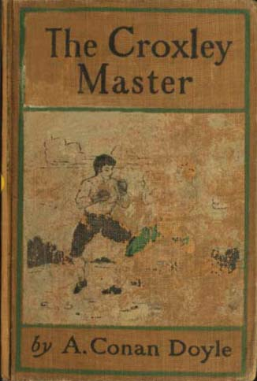

## I

MR. ROBERT MONTGOMERY was seated at his desk, his head upon his hands, in a state of the blackest despondency. Before him was the open ledger with the long columns of Dr. Oldacre's prescriptions. At his elbow lay the wooden tray with the labels in various partitions, the cork box, the lumps of twisted sealing-wax, while in front a rank of empty bottles waited to be filled. But his spirits were too low for work. He sat in silence, with his fine shoulders bowed and his head upon his hands.

Outside, through the grimy surgery window over a foreground of blackened brick and slate, a line of enormous chimneys like Cyclopean pillars upheld the lowering, dun-coloured cloud-bank. For six days in the week they spouted smoke, but to-day the furnace fires were banked, for it was Sunday. Sordid and polluting gloom hung over a district blighted and blasted by the greed of man. There was nothing in the surroundings to cheer a desponding soul, but it was more than his dismal environment which weighed upon the medical assistant.

His trouble was deeper and more personal. The winter session was approaching. He should be back again at the University completing the last year which would give him his medical degree; but alas! he had not the money with which to pay his class fees, nor could he imagine how he could procure it. Sixty pounds were wanted to make his career, and it might have been as many thousands for any chance there seemed to be of his obtaining it.

He was roused from his black meditation by the entrance of Dr. Oldacre himself, a large, clean-shaven, respectable man, with a prim manner and an austere face. He had prospered exceedingly by the support of the local Church interest, and the rule of his life was never by word or action to run a risk of offending the sentiment which had made him. His standard of respectability and of dignity was exceedingly high, and he expected the same from his assistants. His appearance and words were always vaguely benevolent. A sudden impulse came over the despondent student. He would test the reality of this philanthropy.

"I beg your pardon, Dr. Oldacre," said he, rising from his chair; "I have a great favour to ask of you."

The doctor's appearance was not encouraging. His mouth suddenly tightened, and his eyes fell.

"Yes, Mr. Montgomery?"

"You are aware, sir, that I need only one more session to complete my course."

"So you have told me."

"It is very important to me, sir."

"Naturally."

"The fees, Dr. Oldacre, would amount to about sixty pounds."

"I am afraid that my duties call me elsewhere, Mr. Montgomery."

"One moment, sir! I had hoped, sir, that perhaps, if I signed a paper promising you interest upon your money, you would advance this sum to me. I will pay you back, sir, I really will. Or, if you like, I will work it off after I am qualified."

The doctor's lips had thinned into a narrow line. His eyes were raised again, and sparkled indignantly.

"Your request is unreasonable, Mr. Montgomery. I am surprised that you should have made it. Consider, sir, how many thousands of medical students there are in this country. No doubt there are many of them who have a difficulty in finding their fees. Am I to provide for them all? Or why should I make an exception in your favour? I am grieved and disappointed, Mr. Montgomery, that you should have put me into the painful position of having to refuse you." He turned upon his heel, and walked with offended dignity out of the surgery.

The student smiled bitterly, and turned to his work of making up the morning prescriptions. It was poor and unworthy work—work which any weakling might have done as well, and this was a man of exceptional nerve and sinew. But, such as it was, it brought him his board and £1 a week, enough to help him during the summer months and let him save a few pounds towards his winter keep. But those class fees! Where were they to come from? He could not save them out of his scanty wage. Dr. Oldacre would not advance them. He saw no way of earning them. His brains were fairly good, but brains of that quality were a drug in the market. He only excelled in his strength; and where was he to find a customer for that? But the ways of Fate are strange, and his customer was at hand.

"Look y'ere!" said a voice at the door.

Montgomery looked up, for the voice was a loud and rasping one. A young man stood at the entrance—a stocky, bull-necked young miner, in tweed Sunday clothes and an aggressive necktie. He was a sinister-looking figure, with dark, insolent eyes, and the jaw and throat of a bulldog.

"Look y'ere!" said he again. "Why hast thou not sent t' medicine oop as thy master ordered?"

Montgomery had become accustomed to the brutal frankness of the Northern worker. At first it had enraged him, but after a time he had grown callous to it, and accepted it as it was meant. But this was something different. It was insolence—brutal, overbearing insolence, with physical menace behind it.

"What name?" he asked coldly.

"Barton. Happen I may give thee cause to mind that name, yoong man. Mak' oop t' wife's medicine this very moment, look ye, or it will be the worse for thee."

Montgomery smiled. A pleasant sense of relief thrilled softly through him. What blessed safety-valve was this through which his jangled nerves might find some outlet. The provocation was so gross, the insult so unprovoked, that he could have none of those qualms which take the edge off a man's mettle. He finished sealing the bottle upon which he was occupied, and he addressed it and placed it carefully in the rack.

"Look here!" said he turning round to the miner, "your medicine will be made up in its turn and sent down to you. I don't allow folk in the surgery. Wait outside in the waiting-room, if you wish to wait at all."

"Yoong man," said the miner, "thou's got to mak' t' wife's medicine here, and now, and quick, while I wait and watch thee, or else happen thou might need some medicine thysel' before all is over."

"I shouldn't advise you to fasten a quarrel upon me." Montgomery was speaking in the hard, staccato voice of a man who is holding himself in with difficulty. "You'll save trouble if you'll go quietly. If you don't you'll be hurt. Ah, you would? Take it, then!"

The blows were almost simultaneous—a savage swing which whistled past Montgomery's ear, and a straight drive which took the workman on the chin. Luck was with the assistant. That single whizzing uppercut, and the way in which it was delivered, warned him that he had a formidable man to deal with. But if he had underrated his antagonist, his antagonist had also underrated him, and had laid himself open to a fatal blow.

The miner's head had come with a crash against the corner of the surgery shelves, and he had dropped heavily onto the ground. There he lay with his bandy legs drawn up and his hands thrown abroad, the blood trickling over the surgery tiles.

"Had enough?" asked the assistant, breathing fiercely through his nose.

[« Previous Page](page:previous) | [Next Page »](page:next)

But no answer came. The man was insensible. And then the danger of his position came upon Montgomery, and he turned as white as his antagonist. A Sunday, the immaculate Dr. Oldacre with his pious connection, a savage brawl with a patient; he would irretrievably lose his situation if the facts came out. It was not much of a situation, but he could not get another without a reference, and Oldacre might refuse him one. Without money for his classes, and without a situation—what was to become of him? It was absolute ruin.

But perhaps he could escape exposure after all. He seized his insensible adversary, dragged him out into the centre of the room, loosened his collar, and squeezed the surgery sponge over his face. He sat up at last with a gasp and a scowl.

"Domn thee, thou's spoilt my necktie," said he, mopping up the water from his breast.

"I'm sorry I hit you so hard," said Montgomery, apologetically.

"Thou hit me hard! I could stan' such fly-flappin' all day. 'Twas this here press that cracked my pate for me, and thou art a looky man to be able to boast as thou hast outed me. And now I'd be obliged to thee if thou wilt give me t' wife's medicine."

Montgomery gladly made it up and handed it to the miner.

"You are weak still," said he. "Won't you stay awhile and rest?"

"T' wife wants her medicine," said the man, and lurched out at the door.

The assistant, looking after him, saw him rolling with an uncertain step down the street, until a friend met him, and they walked on arm-in-arm. The man seemed in his rough Northern fashion to bear no grudge, and so Montgomery's fears left him. There was no reason why the doctor should know anything about it. He wiped the blood from the floor, put the surgery in order, and went on with his interrupted task, hoping that he had come scathless out of a very dangerous business.

Yet all day he was aware of a sense of vague uneasiness, which sharpened into dismay when, late in the afternoon, he was informed that three gentlemen had called and were waiting for him in the surgery. A coroner's inquest, a descent of detectives, an invasion of angry relatives—all sorts of possibilities rose to scare him. With tense nerves and a rigid face he went to meet his visitors.

They were a very singular trio. Each was known to him by sight; but what on earth the three could be doing together, and, above all, what they could expect from _him_, was a most inexplicable problem.

The first was Sorley Wilson, the son of the owner of the Nonpareil Coalpit. He was a young blood of twenty, heir to a fortune, a keen sportsman, and down for the Easter Vacation from Magdalene College. He sat now upon the edge of the surgery table, looking in thoughtful silence at Montgomery, and twisting the ends of his small, black, waxed moustache.

The second was Purvis, the publican, owner of the chief beershop, and well known as the local bookmaker. He was a coarse, clean-shaven man, whose fiery face made a singular contrast with his ivory-white bald head. He had shrewd, light-blue eyes with foxy lashes, and he also leaned forward in silence from his chair, a fat, red hand upon either knee, and stared critically at the young assistant.

So did the third visitor, Fawcett, the horsebreaker, who leaned back, his long, thin legs, with their box-cloth riding-gaiters, thrust out in front of him, tapping his protruding teeth with his riding-whip, with anxious thought in every line of his rugged, bony face. Publican, exquisite, and horsebreaker were all three equally silent, equally earnest, and equally critical. Montgomery, seated in the midst of them, looked from one to the other.

"Well, gentlemen?" he observed, but no answer came.

The position was embarrassing.

"No," said the horsebreaker, at last. "No. It's off. It's nowt."

"Stand oop, lad; let's see thee standin'." It was the publican who spoke.

Montgomery obeyed. He would learn all about it, no doubt, if he were patient. He stood up and turned slowly round, as if in front of his tailor.

"It's off! It's off!" cried the horsebreaker. "Why, mon, the Master would break him over his knee."

"Oh, that behanged for a yarn!" said the young Cantab. "You can drop out if you like, Fawcett, but I'll see this thing through, if I have to do it alone. I don't hedge a penny. I like the cut of him a great deal better than I liked Ted Barton."

"Look at Barton's shoulders, Mr. Wilson."

"Lumpiness isn't always strength. Give me nerve and fire and breed. That's what wins."

"Ay, sir, you have it theer—you have it theer!" said the fat, red-faced publican, in a thick, suety voice. "It's the same wi' poops. Get 'em clean-bred an' fine, and they'll yark the thick 'uns—yark 'em out o' their skins."

"He's ten good pund on the light side," growled the horsebreaker.

"He's a welter weight, anyhow."

"A hundred and thirty."

"A hundred and fifty, if he's an ounce."

"Well, the master doesn't scale much more than that."

"A hundred and seventy-five."

[« Previous Page](page:previous) | [Next Page »](page:next)

"That was when he was hog-fat and living high. Work the grease out of him, and I lay there's no great difference between them. Have you been weighed lately, Mr. Montgomery?"

It was the first direct question which had been asked him. He had stood in the midst of them, like a horse at a fair, and he was just beginning to wonder whether he was more angry or amused.

"I am just eleven stone," said he.

"I said that he was a welter weight."

"But suppose you was trained?" said the publican. "Wot then?"

"I am always in training."

"In a manner of speakin', do doubt, he _is_ always in trainin'," remarked the horsebreaker. "But trainin' for everyday work ain't the same as trainin' with a trainer; and I dare bet, with all respec' to your opinion, Mr. Wilson, that there's half a stone of tallow on him at this minute."

The young Cantab put his fingers on the assistant's upper arm. Then with his other hand on his wrist he bent the forearm sharply, and felt the biceps, as round and hard as a cricket-ball, spring up under his fingers.

"Feel that!" said he.

The publican and horsebreaker felt it with an air of reverence.

"Good lad! He'll do yet!" cried Purvis.

"Gentlemen," said Montgomery," I think that you will acknowledge that I have been very patient with you. I have listened to all that you have to say about my personal appearance, and now I must really beg that you will have the goodness to tell me what is the matter."

They all sat down in their serious, businesslike way.

"That's easy done, Mr. Montgomery," said the fat-voiced publican. "But before sayin' anything, we had to wait and see whether, in a way of speakin', there was any need for us to say anything at all. Mr. Wilson thinks there is. Mr. Fawcett, who has the same right to his opinion, bein' also a backer and one o' the committee, thinks the other way."

"I thought him too light built, and I think so now," said the horsebreaker, still tapping his prominent teeth with the metal head of his riding-whip. "But happen he may pull through; and he's a fine-made, buirdly young chap, so if you mean to back him, Mr. Wilson——"

"Which I do."

"And you, Purvis?"

"I ain't one to go back, Fawcett."

"Well, I'll stan' to my share of the purse."

"And well I knew you would," said Purvis, "for it would be somethin' new to find Isaac Fawcett as a spoil-sport. Well, then, we make up the hundred for the stake among us, and the fight stands—always supposin' the young man is willin'."

"Excuse all this rot, Mr. Montgomery," said the University man, in a genial voice. "We've begun at the wrong end, I know, but we'll soon straighten it out, and I hope that you will see your way to falling in with our views. In the first place, you remember the man whom you knocked out this morning? He is Barton—the famous Ted Barton."

"I'm sure, sir, you may well be proud to have outed him in one round," said the publican. "Why, it took Morris, the ten-stone-six champion, a deal more trouble than that before he put Barton to sleep. You've done a fine performance, sir, and happen you'll do a finer, if you give yourself the chance."

"I never heard of Ted Barton, beyond seeing the name on a medicine label," said the assistant.

"Well, you may take it from me that he's a slaughterer," said the horsebreaker. "You've taught him a lesson that he needed, for it was always a word and a blow with him, and the word alone was worth five shillin' in a public court. He won't be so ready now to shake his nief in the face of everyone he meets. However, that's neither here nor there."

Montgomery looked at them in bewilderment.

"For goodness sake, gentlemen, tell me what it is you want me to do!" he cried.

"We want you to fight Silas Craggs, better known as the Master of Croxley."

"But why?"

"Because Ted Barton was to have fought him next Saturday. He was the champion of the Wilson coal-pits, and the other was the Master of the iron-folk down at the Croxley smelters. We'd matched our man for a purse of a hundred against the Master. But you've queered our man, and he can't face such a battle with a two-inch cut at the back of his head. There's only one thing to be done, sir, and that is for you to take his place. If you can lick Ted Barton you may lick the Master of Croxley; but if you don't we're done, for there's no one else who is in the same street with him in this district. It's twenty rounds, two-ounce gloves, Queensberry rules, and a decision on points if you fight to the finish."

For a moment the absurdity of the thing drove every other thought out of Montgomery's head. But then there came a sudden revulsion. A hundred pounds!—all he wanted to complete his education was lying there ready to his hand, if only that hand were strong enough to pick it up. He had thought bitterly that morning that there was no market for his strength, but here was one where his muscle might earn more in an hour than his brains in a year. But a chill of doubt came over him.

"How can I fight for the coal-pits?" said he. "I am not connected with them."

"Eh, lad, but thou art!" cried old Purvis. "We've got it down in writin', and it's clear enough. 'Any one connected with the coal-pits.' Doctor Oldacre is the coal-pit club doctor; thou art his assistant. What more can they want?"

"Yes, that's right enough," said the Cantab. "It would be a very sporting thing of you, Mr. Montgomery, if you would come to our help when we are in such a hole. Of course, you might not like to take the hundred pounds; but I have no doubt that, in the case of your winning, we could arrange that it should take the form of a watch or piece of plate, or any other shape which might suggest itself to you. You see, you are responsible for our having lost our champion, so we really feel that we have a claim upon you."

"Give me a moment, gentlemen. It is very unexpected. I am afraid the doctor would never consent to my going—in fact, I am sure that he would not."

"But he need never know—not before the fight, at any rate. We are not bound to give the name of our man. So long as he is within the weight limits on the day of the fight, that is all that concerns any one."

The adventure and the profit would either of them have attracted Montgomery. The two combined were irresistible.

"Gentlemen," said he, "I'll do it!"

The three sprang from their seats. The publican had seized his right hand, the horse-dealer his left, and the Cantab slapped him on the back.

"Good lad! good lad!" croaked the publican. "Eh, mon, but if thou yark him, thou'll rise in one day from being just a common doctor to the best-known mon 'twixt here and Bradford. Thou art a witherin' tyke, thou art, and no mistake; and if thou beat the Master of Croxley, thou'll find all the beer thou want for the rest of thy life waiting for thee at the Four Sacks."

"It is the most sporting thing I ever heard of in my life," said young Wilson. "By George, sir, if you pull it off, you've got the constituency in your pocket, if you care to stand. You know the outhouse in my garden?"

[« Previous Page](page:previous) | [Next Page »](page:next)

"Next the road?"

"Exactly. I turned it into a gymnasium for Ted Barton. You'll find all you want there: clubs, punching ball, bars, dumb-bells, everything. Then you'll want a sparring partner. Ogilvy has been acting for Barton, but we don't think that he is class enough. Barton bears you no grudge. He's a good-hearted fellow, though cross-grained with strangers. He looked upon you as a stranger this morning, but he says he knows you now. He is quite ready to spar with you for practice, and he will come at any hour you will name."

"Thank you; I will let you know the hour," said Montgomery; and so the committee departed jubilant upon their way.

The medical assistant sat for a little time in the surgery turning it over in his mind. He had been trained originally at the University by the man who had been middle-weight champion in his day. It was true that his teacher was long past his prime, slow upon his feet and stiff in his joints, but even so he was still a tough antagonist; but Montgomery had found at last that he could more than hold his own with him. He had won the University medal, and his teacher, who had trained so many students, was emphatic in his opinion that he had never had one who was in the same class with him. He had been exhorted to go in for the Amateur Championships, but he had no particular ambition in that direction. Once he had put on the gloves with Hammer Tunstall in a booth at a fair, and had fought three rattling rounds, in which he had the worst of it, but had made the prize-fighter stretch himself to the uttermost. There was his whole record, and was it enough to encourage him to stand up to the Master of Croxley? He had never heard of the Master before, but then he had lost touch of the ring during the last few years of hard work. After all, what did it matter? If he won, there was the money, which meant so much to him. If he lost, it would only mean a thrashing. He could take punishment without flinching, of that he was certain. If there were only one chance in a hundred of pulling it off, then it was worth his while to attempt it.

Dr. Oldacre, new come from church, with an ostentatious Prayer-book in his kid-gloved hand, broke in upon his meditation.

"You don't go to service, I observe, Mr. Montgomery," said he, coldly.

"No, sir; I have had some business to detain me."

"It is very near to my heart that my household should set a good example. There are so few educated people in this district that a great responsibility devolves upon us. If we do not live up to the highest, how can we expect these poor workers to do so? It is a dreadful thing to reflect that the parish takes a great deal more interest in an approaching glove-fight than in their religious duties."

"A glove-fight, sir?" said Montgomery, guiltily.

"I believe that to be the correct term. One of my patients tells me that it is the talk of the district. A local ruffian, a patient of ours, by the way, is matched against a pugilist over at Croxley. I cannot understand why the law does not step in and stop so degrading an exhibition. It is really a prize-fight."

"A glove fight, you said."

"I am informed that a two-ounce glove is an evasion by which they dodge the law, and make it difficult for the police to interfere. They contend for a sum of money. It seems dreadful and almost incredible—does it not?—to think that such scenes can be enacted within a few miles of our peaceful home. But you will realize, Mr. Montgomery, that while there are such influences for us to counteract, it is very necessary that we should live up to our highest."

The doctor's sermon would have had more effect if the assistant had not once or twice had occasion to test his highest and come upon it at unexpectedly humble elevations. It is always so particularly easy to "compound for sins we're most inclined to by damning those we have no mind to." In any case, Montgomery felt that of all the men concerned in such a fight—promoters, backers, spectators—it is the actual fighter who holds the strongest and most honourable position. His conscience gave him no concern upon the subject. Endurance and courage are virtues, not vices, and brutality is, at least, better than effeminacy.

There was a little tobacco-shop at the corner of the street, where Montgomery got his bird's-eye and also his local information, for the shopman was a garrulous soul, who knew everything about the affairs of the district. The assistant strolled down there after tea and asked, in a casual way, whether the tobacconist had ever heard of the Master of Croxley.

"Heard of him! Heard of him!" the little man could hardly articulate in his astonishment. "Why, sir, he's the first mon o' the district, an' his name's as well known in the West Riding as the winner o' t' Derby. But Lor', sir"—here he stopped and rummaged among a heap of papers. "They are makin' a fuss about him on account o' his fight wi' Ted Barton, and so the _Croxley Herald_ has his life an' record, an' here it is, an' thou canst read it for thysel'."

The sheet of the paper which he held up was a lake of print around an islet of illustration. The latter was a coarse wood-cut of a pugilist's head and neck set in a cross-barred jersey. It was a sinister but powerful face, the face of a debauched hero, clean-shaven, strongly eyebrowed, keen-eyed, with a huge aggressive jaw and an animal dewlap beneath it. The long, obstinate cheeks ran flush up to the narrow, sinister eyes. The mighty neck came down square from the ears and curved outwards into shoulders, which had lost nothing at the hands of the local artist. Above was written "Silas Craggs," and beneath, "The Master of Croxley."

"Thou'll find all about him there, sir," said the tobacconist. "He's a witherin' tyke, he is, and we're proud to have him in the county. If he hadn't broke his leg he'd have been champion of England."

"Broke his leg, has he?"

"Yes, and it set badly. They ca' him owd K behind his bock, for thot is how his two legs look. But his arms—well, if they was both stropped to a bench, as the sayin' is, I wonder where the champion of England would be then."

"I'll take this with me," said Montgomery; and putting the paper into his pocket he returned home.

It was not a cheering record which he read there. The whole history of the Croxley Master was given in full, his many victories, his few defeats.

"Born in 1857," said the provincial biographer, "Silas Craggs, better known in sporting circles as The Master of Croxley, is now in his fortieth year."

"Hang it, I'm only twenty-three," said Montgomery to himself, and read on more cheerfully.

"Having in his youth shown a surprising aptitude for the game, he fought his way up among his comrades, until he became the recognized champion of the district and won the proud title which he still holds. Ambitious of a more than local fame, he secured a patron, and fought his first fight against Jack Barton, of Birmingham, in May, 1880, at the old Loiterers' Club. Craggs, who fought at ten-stone-two at the time, had the better of fifteen rattling rounds, and gained an award on points against the Midlander. Having disposed of James Dunn, of Rotherhithe, Cameron, of Glasgow, and a youth named Fernie, he was thought so highly of by the fancy that he was matched against Ernest Willox, at that time middle-weight champion of the North of England, and defeated him in a hard-fought battle, knocking him out in the tenth round after a punishing contest. At this period it looked as if the very highest honours of the ring were within the reach of the young Yorkshireman, but he was laid upon the shelf by a most unfortunate accident. The kick of a horse broke his thigh, and for a year he was compelled to rest himself. When he returned to his work the fracture had set badly, and his activity was much impaired. It was owing to this that he was defeated in seven rounds by Willox, the man whom he had previously beaten, and afterwards by James Shaw, of London, though the latter acknowledged that he had found the toughest customer of his career. Undismayed by his reverses, the Master adapted the style of his fighting to his physical disabilities and resumed his career of victory—defeating Norton (the black), Bobby Wilson, and Levy Cohen, the latter a heavy-weight. Conceding two stone, he fought a draw with the famous Billy McQuire, and afterwards, for a purse of fifty pounds, he defeated Sam Hare at the Pelican Club, London. In 1891 a decision was given against him upon a foul when fighting a winning fight against Jim Taylor, the Australian middle-weight, and so mortified was he by the decision, that he withdrew from the ring. Since then he has hardly fought at all save to accommodate any local aspirant who may wish to learn the difference between a bar-room scramble and a scientific contest. The latest of these ambitious souls comes from the Wilson coal-pits, which have undertaken to put up a stake of £100 and back their local champion. There are various rumours afloat as to who their representative is to be, the name of Ted Barton being freely mentioned; but the betting, which is seven to one on the Master against any untried man, is a fair reflection of the feeling of the community."

Montgomery read it over twice, and it left him with a very serious face. No light matter this which he had undertaken; no battle with a rough-and-tumble fighter who presumed upon a local reputation. The man's record showed that he was first-class—or nearly so. There were a few points in his favour, and he must make the most of them. There was age—twenty-three against forty. There was an old ring proverb that "Youth will be served," but the annals of the ring offer a great number of exceptions. A hard veteran, full of cool valour and ring-craft, could give ten or fifteen years and a beating to most striplings. He could not rely too much upon his advantage in age. But then there was the lameness; that must surely count for a great deal. And, lastly, there was the chance that the Master might underrate his opponent, that he might be remiss in his training, and refuse to abandon his usual way of life, if he thought that he had an easy task before him. In a man of his age and habits this seemed very possible. Montgomery prayed that it might be so. Meanwhile, if his opponent were the best man who ever jumped the ropes into a ring, his own duty was clear. He must prepare himself carefully, throw away no chance, and do the very best that he could. But he knew enough to appreciate the difference which exists in boxing, as in every sport, between the amateur and the professional. The coolness, the power of hitting, above all the capability of taking punishment, count for so much. Those specially developed, gutta-percha-like abdominal muscles of the hardened pugilist will take without flinching a blow which would leave another man writhing on the ground. Such things are not to be acquired in a week, but all that could be done in a week should be done.

[« Previous Page](page:previous) | [Next Page »](page:next)

The medical assistant had a good basis to start from. He was 5 feet 11 inches—tall enough for anything on two legs, as the old ring men used to say—lithe and spare, with the activity of a panther, and a strength which had hardly yet ever found its limitations. His muscular development was finely hard, but his power came rather from that higher nerve-energy which counts for nothing upon a measuring tape. He had the well-curved nose, and the widely-opened eye which never yet were seen upon the face of a craven, and behind everything he had the driving force, which came from the knowledge that his whole career was at stake upon the contest. The three backers rubbed their hands when they saw him at work punching the ball in the gymnasium next morning; and Fawcett, the horsebreaker, who had written to Leeds to hedge his bets, sent a wire to cancel the letter, and to lay another fifty at the market price of seven to one.

Montgomery's chief difficulty was to find time for his training without any interference from the doctor. His work took him a large part of the day, but as the visiting was done on foot, and considerable distances had to be traversed, it was a training in itself. For the rest, he punched the swinging ball and worked with the dumb-bells for an hour every morning and evening, and boxed twice a day with Ted Barton in the gymnasium, gaining as much profit as could be got from a rushing, two-handed slogger. Barton was full of admiration for his cleverness and quickness, but doubtful about his strength. Hard hitting was the feature of his own style, and he exacted it from others.

"Lord, sir, that's a turble poor poonch for an eleven-stone man!" he would cry. "Thou wilt have to hit harder than that afore t' Master will know that thou art theer. Ah, thot's better, mon, thot's fine!" he would add, as his opponent lifted him across the room on the end of a right counter. "Thot's how I likes to feel 'em. Happen thou'lt pull through yet." He chuckled with joy when Montgomery knocked him into a corner. "Eh, mon, thou art comin' along grand. Thou hast fair yarked me off my legs. Do it again, lad, do it again!"

The only part of Montgomery's training which came within the doctor's observation was his diet, and that puzzled him considerably.

"You will excuse my remarking, Mr. Montgomery, that you are becoming rather particular in your tastes. Such fads are not to be encouraged in one's youth. Why do you eat toast with every meal?"

"I find that it suits me better than bread, sir."

"It entails unnecessary work upon the cook. I observe, also, that you have turned against potatoes."

"Yes, sir; I think that I am better without them."

"And you no longer drink your beer?"

"No, sir."

"These causeless whims and fancies are very much to be deprecated, Mr. Montgomery. Consider how many there are to whom these very potatoes and this very beer would be most acceptable."

"No doubt, sir. But at present I prefer to do without them."

They were sitting alone at lunch, and the assistant thought that it would be a good opportunity of asking leave for the day of the fight.

"I should be glad if you could let me have leave for Saturday, Doctor Oldacre."

"It is very inconvenient upon so busy a day."

"I should do a double day's work on Friday so as to leave everything in order. I should hope to be back in the evening."

"I am afraid I cannot spare you, Mr. Montgomery."

This was a facer. If he could not get leave he would go without it.

"You will remember, Doctor Oldacre, that when I came to you it was understood that I should have a clear day every month. I have never claimed one. But now there are reasons why I wish to have a holiday upon Saturday."

Doctor Oldacre gave in with a very bad grace.

"Of course, if you insist upon your formal rights, there is no more to be said, Mr. Montgomery, though I feel that it shows a certain indifference to my comfort and the welfare of the practice. Do you still insist?"

"Yes, sir."

"Very good. Have your way."

The doctor was boiling over with anger, but Montgomery was a valuable assistant—steady, capable, and hard-working—and he could not afford to lose him. Even if he had been prompted to advance those class fees, for which his assistant had appealed, it would have been against his interests to do so, for he did not wish him to qualify, and he desired him to remain in his subordinate position, in which he worked so hard for so small a wage. There was something in the cool insistence of the young man, a quiet resolution in his voice as he claimed his Saturday, which aroused his curiosity.

"I have no desire to interfere unduly with your affairs, Mr. Montgomery, but were you thinking of having a day in Leeds upon Saturday?"

"No, sir."

"In the country?"

"Yes, sir."

"You are very wise. You will find a quiet day among the wild flowers a very valuable restorative. Had you thought of any particular direction?"

"I am going over Croxley way."

"Well, there is no prettier country when once you are past the iron-works. What could be more delightful than to lie upon the Fells, basking in the sunshine, with perhaps some instructive and elevating book as your companion? I should recommend a visit to the ruins of St. Bridget's Church, a very interesting relic of the early Norman era. By the way, there is one objection which I see to your going to Croxley on Saturday. It is upon that date, as I am informed, that that ruffianly glove-fight takes place. You may find yourself molested by the blackguards whom it will attract."

"I will take my chance of that, sir," said the assistant.

On the Friday night, which was the last before the fight, Montgomery's three backers assembled in the gymnasium and inspected their man as he went through some light exercises to keep his muscles supple. He was certainly in splendid condition, his skin shining with health, and his eyes with energy and confidence. The three walked round him and exulted.

"He's simply ripping!" said the undergraduate. "By gad, you've come out of it splendidly. You're as hard as a pebble, and fit to fight for your life."

"Happen he's a trifle on the fine side," said the publican. "Runs a bit light at the loins, to my way of thinkin'."

"What weight to-day?"

"Ten stone eleven," the assistant answered.

"That's only three pund off in a week's trainin'," said the horsebreaker. "He said right when he said that he was in condition. Well, it's fine stuff all there is of it, but I'm none so sure as there is enough." He kept poking his finger into Montgomery, as if he were one of his horses. "I hear that the Master will scale a hundred and sixty odd at the ring-side."

"But there's some of that which he'd like well to pull off and leave behind wi' his shirt," said Purvis. "I hear they've had a rare job to get him to drop his beer, and if it had not been for that great red-headed wench of his they'd never ha' done it. She fair scratted the face off a potman that had brought him a gallon from t' Chequers. They say the hussy is his sparrin' partner, as well as his sweetheart, and that his poor wife is just breakin' her heart over it. Hullo, young 'un, what do you want?"

The door of the gymnasium had opened, and a lad about sixteen, grimy and black with soot and iron, stepped into the yellow glare of the oil-lamp. Ted Barton seized him by the collar.

"See here, thou yoong whelp, this is private, and we want noan o' thy spyin'!"

"But I maun speak to Mr. Wilson."

The young Cantab stepped forward.

"Well, my lad, what is it?"

"It's aboot t' fight, Mr. Wilson, sir. I wanted to tell your mon somethin' aboot t' Maister."

"We've no time to listen to gossip, my boy. We know all about the Master."

"But thou doant, sir. Nobody knows but me and mother, and we thought as we'd like thy mon to know, sir, for we want him to fair bray him."

"Oh, you want the Master fair brayed, do you? So do we. Well, what have you to say?"

"Is this your mon, sir?"

"Well, suppose it is?"

"Then it's him I want to tell aboot it. T' Maister is blind o' the left eye."

"Nonsense!"

"It's true, sir. Not stone blind, but rarely fogged. He keeps it secret, but mother knows, and so do I. If thou slip him on the left side he can't cop thee. Thou'll find it right as I tell thee. And mark him when he sinks his right. 'Tis his best blow, his right upper-cut. T' Maister's finisher, they ca' it at t' works. It's a turble blow, when it do come home."

"Thank you, my boy. This is information worth having about his sight," said Wilson. "How came you to know so much? Who are you?"

"I'm his son, sir."

Wilson whistled.

"And who sent you to us?"

"My mother. I maun get back to her again."

"Take this half-crown."

"No, sir, I don't seek money in comin' here. I do it——"

"For love?" suggested the publican.

"For hate!" said the boy, and darted off into the darkness.

"Seems to me t' red-headed wench may do him more harm than good, after all," remarked the publican. "And now," Mr. Montgomery, sir, you´ve done enough for this evenin', an' a nine hours' sleep is the best trainin' before a battle. Happen this time to-morrow night you'll be safe back again with your £100 in your pocket."

[« Previous Page](page:previous) | [Next Page »](page:next)
