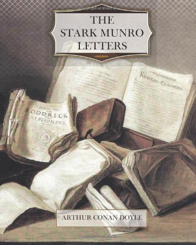

I may be doing you an injustice, Bertie, but it seemed to me in your last that there were indications that the free expression of my religious views had been distasteful to you. That you should disagree with me I am prepared for; but that you should object to free and honest discussion of those subjects which above all others men should be honest over, would, I confess, be a disappointment. The Freethinker is placed at this disadvantage in ordinary society, that whereas it would be considered very bad taste upon his part to obtrude his unorthodox opinion, no such consideration hampers those with whom he disagrees. There was a time when it took a brave man to be a Christian. Now it takes a brave man not to be. But if we are to wear a gag, and hide our thoughts when writing in confidence to our most intimate——no, but I won't believe it. You and I have put up too many thoughts together and chased them where-ever{sic} they would double, Bertie; so just write to me like a good fellow, and tell me that I am an ass. Until I have that comforting assurance, I shall place a quarantine upon everything which could conceivably be offensive to you.

\[caption id="attachment\_1158" align="alignnone" width="400"\] [Buy Stark Munro Letters from Amazon](http://www.amazon.com/gp/product/1475223544/ref=as_li_ss_tl?ie=UTF8&camp=1789&creative=390957&creativeASIN=1475223544&linkCode=as2&tag=sirconandoyle-20)\[/caption\]

Does not lunacy strike you, Bertie, as being a very eerie thing? It is a disease of the soul. To think that you may have a man of noble mind, full of every lofty aspiration, and that a gross physical cause, such as the fall of a spicule of bone from the inner table of his skull on to the surface of the membrane which covers his brain, may have the ultimate effect of turning him into an obscene creature with every bestial attribute! That a man's individuality should swing round from pole to pole, and yet that one life should contain these two contradictory personalities—is it not a wondrous thing?

I ask myself, where is the man, the very, very inmost essence of the man? See how much you may subtract from him without touching it. It does not lie in the limbs which serve him as tools, nor in the apparatus by which he is to digest, nor in that by which he is to inhale oxygen. All these are mere accessories, the slaves of the lord within. Where, then, is he? He does not lie in the features which are to express his emotions, nor in the eyes and ears which can be dispensed with by the blind and deaf. Nor is he in the bony framework which is the rack over which nature hangs her veil of flesh. In none of these things lies the essence of the man. And now what is left? An arched whitish putty-like mass, some fifty odd ounces in weight, with a number of white filaments hanging down from it, looking not unlike the medusae which float in our summer seas. But these filaments only serve to conduct nerve force to muscles and to organs which serve secondary purposes. They may themselves therefore be disregarded. Nor can we stop here in our elimination. This central mass of nervous matter may be pared down on all sides before we seem to get at the very seat of the soul. Suicides have shot away the front lobes of the brain, and have lived to repent it. Surgeons have cut down upon it and have removed sections. Much of it is merely for the purpose of furnishing the springs of motion, and much for the reception of impressions. All this may be put aside as we search for the physical seat of what we call the soul—the spiritual part of the man. And what is left then? A little blob of matter, a handful of nervous dough, a few ounces of tissue, but there—somewhere there—lurks that impalpable seed, to which the rest of our frame is but the pod. The old philosophers who put the soul in the pineal gland were not right, but after all they were uncommonly near the mark.

You'll find my physiology even worse than my theology, Bertie. I have a way of telling stories backwards to you, which is natural enough when you consider that I always sit down to write under the influence of the last impressions which have come upon me. All this talk about the soul and the brain arises simply from the fact that I have been spending the last few weeks with a lunatic. And how it came about I will tell you as clearly as I can.

You remember that in my last I explained to you how restive I had been getting at home, and how my idiotic mistake had annoyed my father and had made my position here very uncomfortable. Then I mentioned, I think, that I had received a letter from Christie & Howden, the lawyers. Well, I brushed up my Sunday hat, and my mother stood on a chair and landed me twice on the ear with a clothes brush, under the impression that she was making the collar of my overcoat look more presentable. With which accolade out I sallied into the world, the dear soul standing on the steps, peering after me and waving me success.

Well, I was in considerable trepidation when I reached the office, for I am a much more nervous person than any of my friends will ever credit me with being. However, I was shown in at once to Mr. James Christie, a wiry, sharp, thin-lipped kind of man, with an abrupt manner, and that sort of Scotch precision of speech which gives the impression of clearness of thought behind it.

"I understand from Professor Maxwell that you have been looking about for an opening, Mr. Munro," said he.

Maxwell had said that he would give me a hand if he could; but you remember that he had a reputation for giving such promises rather easily. I speak of a man as I find him, and to me he has been an excellent friend.

"I should be very happy to hear of any opening," said I.

"Of your medical qualifications there is no need to speak," he went on, running his eyes all over me in the most questioning way. "Your Bachelorship of Medicine will answer for that. But Professor Maxwell thought you peculiarly fitted for this vacancy for physical reasons. May I ask you what your weight is?"

"Fourteen stone."

"And you stand, I should judge, about six feet high?"

"Precisely."

"Accustomed too, as I gather, to muscular exercise of every kind. Well, there can be no question that you are the very man for the post, and I shall be very happy to recommend you to Lord Saltire."

"You forget," said I, "that I have not yet heard what the position is, or the terms which you offer."

He began to laugh at that. "It was a little precipitate on my part," said he; "but I do not think that we are likely to quarrel as to position or terms. You may have heard perhaps of the sad misfortune of our client, Lord Saltire? Not? To put it briefly then, his son, the Hon. James Derwent, the heir to the estates and the only child, was struck down by the sun while fishing without his hat last July. His mind has never recovered from the shock, and he has been ever since in a chronic state of moody sullenness which breaks out every now and then into violent mania. His father will not allow him to be removed from Lochtully Castle, and it is his desire that a medical man should stay there in constant attendance upon his son. Your physical strength would of course be very useful in restraining those violent attacks of which I have spoken. The remuneration will be twelve pounds a month, and you would be required to take over your duties to-morrow."

I walked home, my dear Bertie, with a bounding heart, and the pavement like cotton wool under my feet. I found just eightpence in my pocket, and I spent the whole of it on a really good cigar with which to celebrate the occasion. Old Cullingworth has always had a very high opinion of lunatics for beginners. "Get a lunatic, my boy! Get a lunatic!" he used to say. Then it was not only the situation, but the fine connection that it opened up. I seemed to see exactly what would happen. There would be illness in the family,—Lord Saltire himself perhaps, or his wife. There would be no time to send for advice. I would be consulted. I would gain their confidence and become their family attendant. They would recommend me to their wealthy friends. It was all as clear as possible. I was debating before I reached home whether it would be worth my while to give up a lucrative country practice in order to take the Professorship which might be offered me.

My father took the news philosophically enough, with some rather sardonic remark about my patient and me being well qualified to keep each other company. But to my mother it was a flash of joy, followed by a thunderclap of consternation. I had only three under-shirts, the best of my linen had gone to Belfast to be refronted and recuffed, the night-gowns were not marked yet—there were a dozen of those domestic difficulties of which the mere male never thinks. A dreadful vision of Lady Saltire looking over my things and finding the heel out of one of my socks obsessed my mother. Out we trudged together, and before evening her soul was at rest, and I had mortgaged in advance my first month's salary. She was great, as we walked home, upon the grand people into whose service I was to enter. "As a matter of fact, my dear," said she, "they are in a sense relations of yours. You are very closely allied to the Percies, and the Saltires have Percy blood in them also. They are only a cadet branch, and you are close upon the main line; but still it is not for us to deny the connection." She brought a cold sweat out upon me by suggesting that she should make things easy by writing to Lord Saltire and explaining our respective positions. Several times during the evening I heard her murmur complacently that they were only the cadet branch.

Am I not the slowest of story-tellers? But you encourage me to it by your sympathetic interest in details. However, I shall move along a little faster now. Next morning I was off to Lochtully, which, as you know, is in the north of Perthshire. It stands three miles from the station, a great gray pinnacled house, with two towers cocking out above the fir woods, like a hare's ears from a tussock of grass. As we drove up to the door I felt pretty solemn—not at all as the main line should do when it condescends to visit the cadet branch. Into the hall as I entered came a grave learned-looking man, with whom in my nervousness I was about to shake hands cordially. Fortunately he forestalled the impending embrace by explaining that he was the butler. He showed me into a small study, where everything stank of varnish and morocco leather, there to await the great man. He proved when he came to be a much less formidable figure than his retainer—indeed, I felt thoroughly at my ease with him from the moment he opened his mouth. He is grizzled, red-faced, sharp-featured, with a prying and yet benevolent expression, very human and just a trifle vulgar. His wife, however, to whom I was afterwards introduced, is a most depressing person,—pale, cold, hatchet-faced, with drooping eyelids and very prominent blue veins at her temples. She froze me up again just as I was budding out under the influence of her husband. However, the thing that interested me most of all was to see my patient, to whose room I was taken by Lord Saltire after we had had a cup of tea.

The room was a large bare one, at the end of a long corridor. Near the door was seated a footman, placed there to fill up the gap between two doctors, and looking considerably relieved at my advent. Over by the window (which was furnished with a wooden guard, like that of a nursery) sat a tall, yellow-haired, yellow-bearded, young man, who raised a pair of startled blue eyes as we entered. He was turning over the pages of a bound copy of the Illustrated London News.

"James," said Lord Saltire, "this is Dr. Stark Munro, who has come to look after you."

My patient mumbled something in his beard, which seemed to me suspiciously like "Damn Dr. Stark Munro!" The peer evidently thought the same, for he led me aside by the elbow.

"I don't know whether you have been told that James is a little rough in his ways at present," said he; "his whole nature has deteriorated very much since this calamity came upon him. You must not be offended by anything he may say or do."

"Not in the least," said I.

"There is a taint of this sort upon my wife's side," I whispered the little lord; "her uncle's symptoms were identical. Dr. Peterson says that the sunstroke was only the determining cause. The predisposition was already there. I may tell you that the footman will always be in the next room, so that you can call him if you need his assistance."

Well, it ended by lord and lacquey moving off, and leaving me with my patient. I thought that I should lose no time in establishing a kindly relation with him, so I drew a chair over to his sofa and began to ask him a few questions about his health and habits. Not a word could I get out of him in reply. He sat as sullen as a mule, with a kind of sneer about his handsome face, which showed me very well that he had heard everything. I tried this and tried that, but not a syllable could I get from him; so at last I turned from him and began to look over some illustrated papers on the table. He doesn't read, it seems, and will do nothing but look at pictures. Well, I was sitting like this with my back half turned, when you can imagine my surprise to feel something plucking gently at me, and to see a great brown hand trying to slip its way into my coat pocket. I caught at the wrist and turned swiftly round, but too late to prevent my handkerchief being whisked out and concealed behind the Hon. James Derwent, who sat grinning at me like a mischievous monkey.

"Come, I may want that," said I, trying to treat the matter as a joke.

He used some language which was more scriptural than religious. I saw that he did not mean giving it up, but I was determined not to let him get the upper hand over me. I grabbed for the handkerchief; and he, with a snarl, caught my hand in both of his. He had a powerful grip, but I managed to get his wrist and to give it a wrench round, until, with a howl, he dropped my property.

"What fun," said I, pretending to laugh. "Let us try again. Now, you take it up, and see if I can get it again."

But he had had enough of that game. Yet he appeared to be better humoured than before the incident, and I got a few short answers to the questions which I put to him.

And here comes in the text which started me preaching about lunacy at the beginning of this letter. WHAT a marvellous thing it is! This man, from all I can learn of him, has suddenly swung clean over from one extreme of character to the other. Every plus has in an instant become a minus. He's another man, but in the same case. I am told that he used to be (only a few months ago, mind you) most fastidious in dress and speech. Now he is a foul-tongued rough! He had a nice taste in literature. Now he stares at you if you speak of Shakespeare. Queerest of all, he used to be a very high-and-dry Tory in his opinions. He is fond now of airing the most democratic views, and in a needlessly offensive way. When I did get on terms with him at last, I found that there was nothing on which he could be drawn on to talk so soon as on politics. In substance, I am bound to say that I think his new views are probably saner than his old ones, but the insanity lies in his sudden reasonless change and in his violent blurts of speech.

It was some weeks, however, before I gained his confidence, so far as to be able to hold a real conversation with him. For a long time he was very sullen and suspicious, resenting the constant watch which I kept upon him. This could not be relaxed, for he was full of the most apish tricks. One day he got hold of my tobacco pouch, and stuffed two ounces of my tobacco into the long barrel of an Eastern gun which hangs on the wall. He jammed it all down with the ramrod, and I was never able to get it up again. Another time he threw an earthenware spittoon through the window, and would have sent the clock after it had I not prevented him. Every day I took him for a two hours' constitutional, save when it rained, and then we walked religiously for the same space up and down the room. Heh! but it was a deadly, dreary, kind of life.

I was supposed to have my eye upon him all day, with a two-hour interval every afternoon and an evening to myself upon Fridays. But then what was the use of an evening to myself when there was no town near, and I had no friends whom I could visit? I did a fair amount of reading, for Lord Saltire let me have the run of his library. Gibbon gave me a couple of enchanting weeks. You know the effect that he produces. You seem to be serenely floating upon a cloud, and looking down on all these pigmy armies and navies, with a wise Mentor ever at your side to whisper to you the inner meaning of all that majestic panorama.

Now and again young Derwent introduced some excitement into my dull life. On one occasion when we were walking in the grounds, he suddenly snatched up a spade from a grass-plot, and rushed at an inoffensive under-gardener. The man ran screaming for his life, with my patient cursing at his very heels, and me within a few paces of him. When I at last laid my hand on his collar, he threw down his weapon and burst into shrieks of laughter. It was only mischief and not ferocity; but when that under-gardener saw us coming after that he was off with a face like a cream cheese. At night the attendant slept in a camp-bed at the foot of the patient's, and my room was next door, so that I could be called if necessary. No, it was not a very exhilarating life!

We used to go down to family meals when there were no visitors; and there we made a curious quartette: Jimmy (as he wished me to call him) glum and silent; I with the tail of my eye always twisted round to him; Lady Saltire with her condescending eyelids and her blue veins; and the good-natured peer, fussy and genial, but always rather subdued in the presence of his wife. She looked as if a glass of good wine would do her good, and he as if he would be the better for abstinence; and so, in accordance with the usual lopsidedness of life, he drank freely, and she took nothing but lime-juice and water. You cannot imagine a more ignorant, intolerant, narrow-minded woman than she. If she had only been content to be silent and hidden that small brain of hers, it would not have mattered; but there was no end to her bitter and exasperating clacking. What was she after all but a thin pipe for conveying disease from one generation to another? She was bounded by insanity upon the north and upon the south. I resolutely set myself to avoid all argument with her; but she knew, with her woman's instinct, that we were as far apart as the poles, and took a pleasure in waving the red flag before me. One day she was waxing eloquent as to the crime of a minister of an Episcopal church performing any service in a Presbyterian chapel. Some neighbouring minister had done it, it seems; and if he had been marked down in a pot house she could not have spoken with greater loathing. I suppose that my eyes were less under control than my tongue, for she suddenly turned upon me with:

"I see that you don't agree with me, Dr. Munro."

I replied quietly that I did not, and tried to change the conversation; but she was not to be shaken off.

"Why not, may I ask?"

I explained that in my opinion the tendency of the age was to break down those ridiculous doctrinal points which are so useless, and which have for so long set people by the ears. I added that I hoped the time was soon coming when good men of all creeds would throw this lumber overboard and join hands together.

She half rose, almost speechless with indignation.

"I presume," said she, "that you are one of those people who would separate the Church from the State?"

"Most certainly," I answered.

She stood erect in a kind of cold fury, and swept out of the room. Jimmy began to chuckle, and his father looked perplexed.

"I am sorry that my opinions are offensive to Lady Saltire," I remarked.

"Yes, yes; it's a pity; a pity," said he "well, well, we must say what we think; but it's a pity you think it—a very great pity."

I quite expected to get my dismissal over this business, and indeed, indirectly I may say that I did so. From that day Lady Saltire was as rude to me as she could be, and never lost an opportunity of making attacks upon what she imagined to be my opinions. Of these I never took the slightest notice; but at last on an evil day she went for me point-blank, so that there was no getting away from her. It was just at the end of lunch, when the footman had left the room. She had been talking about Lord Saltire's going up to London to vote upon some question in the House of Lords.

"Perhaps, Dr. Munro," said she, turning acidly upon me, "that is also an institution which has not been fortunate enough to win your approval."

"It is a question, Lady Saltire, which I should much prefer not to discuss," I answered.

"Oh, you might just as well have the courage of your convictions," said she. "Since you desire to despoil the National Church, it is natural enough that you should wish also to break up the Constitution. I have heard that an atheist is always a red republican."

Lord Saltire rose, wishing, I have no doubt, to put an end to the conversation. Jimmy and I rose also; and suddenly I saw that instead of moving towards the door he was going to his mother. Knowing his little tricks, I passed my hand under his arm, and tried to steer him away. She noticed it, however, and interfered.

"Did you wish to speak to me, James?"

"I want to whisper in your ear, mother."

"Pray don't excite yourself, sir," said I, again attempting to detain him. Lady Saltire arched her aristocratic eyebrows.

"I think, Dr. Munro, that you push your authority rather far when you venture to interfere between a mother and her son," said she. "What was it, my poor dear boy?"

Jimmy bent down and whispered something in her ear. The blood rushed into her pale face, and she sprang from him as if he had struck her. Jimmy began to snigger.

"This is your doing, Dr. Munro," she cried furiously. "You have corrupted my son's mind, and encouraged him to insult his mother."

"My dear! My dear!" said her husband soothingly, and I quietly led the recalcitrant Jimmy upstairs. I asked him what it was that he had said to his mother, but got only chuckles in reply.

I had a presentiment that I should hear more of the matter; and I was not wrong. Lord Saltire called me into his study in the evening.

"The fact is, doctor," said he, "that Lady Saltire has been extremely annoyed and grieved about what occurred at lunch to-day. Of course, you can imagine that such an expression coming from her own son, shocked her more than I can tell."

"I assure you, Lord Saltire," said I, "that I have no idea at all what passed between Lady Saltire and my patient."

"Well," said he, "without going into details, I may say that what he whispered was a blasphemous wish, most coarsely expressed, as to the future of that Upper House to which I have the honor to belong."

"I am very sorry," said I, "and I assure you that I have never encouraged him in his extreme political views, which seem to me to be symptoms of his disease."

"I am quite convinced that what you say is true," he answered; "but Lady Saltire is unhappily of the opinion that you have instilled these ideas into him. You know that it is a little difficult sometimes to reason with a lady. However, I have no doubt that all may be smoothed over if you would see Lady Saltire and assure her that she has misunderstood your views upon this point, and that you are personally a supporter of a Hereditary Chamber."

It put me in a tight corner, Bertie; but my mind was instantly made up. From the first word I had read my dismissal in every uneasy glance of his little eyes.

"I am afraid," said I, "that that is rather further than I am prepared to go. I think that since there has been for some weeks a certain friction between Lady Saltire and myself, it would perhaps be as well that I should resign the post which I hold in your household. I shall be happy, however, to remain here until you have found some one to take over my duties."

"Well, I am sorry it has come to this, and yet it may be that you are right," said he, with an expression of relief; "as to James, there need be no difficulty about that, for Dr. Patterson could come in tomorrow morning."

"Then to-morrow morning let it be," I answered.

"Very good, Dr. Munro; I will see that you have your cheque before you go."

So there was the end of all my fine dreams about aristocratic practices and wonderful introductions! I believe the only person in the whole house who regretted me was Jimmy, who was quite downcast at the news. His grief, however, did not prevent him from brushing my new top-hat the wrong way on the morning that I left. I did not notice it until I reached the station, and a most undignified object I must have looked when I took my departure.

So ends the history of a failure. I am, as you know, inclined to fatalism, and do not believe that such a thing as chance exists; so I am bound to think that this experience was given to me for some end. It was a preliminary canter for the big race, perhaps. My mother was disappointed, but tried to show it as little as possible. My father was a little sardonic over the matter. I fear that the gap between us widens. By the way, an extraordinary card arrived from Cullingworth during my absence. "You are my man," said he; "mind that I am to have you when I want you." There was no date and no address, but the postmark was Bradfield in the north of England. Does it mean nothing? Or may it mean everything? We must wait and see.

Good-bye, old man. Let me hear equally fully about your own affairs. How did the Rattray business go off?
