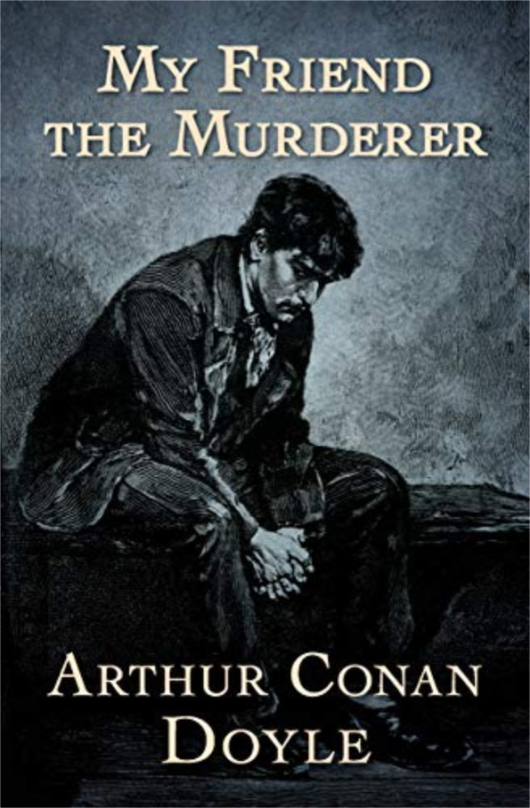

‘My Friend the Murderer’ is a short story by Sherlock Holmes creator Sir Arthur Conan Doyle. Our narrator is a doctor who works at an Australian prison. The doctor is urged to take some time to speak to inmate 82, a man named Maloney whose villainous reputation precedes him. As the doctor gets to know him, he is shocked by what Maloney has to say. A gripping short story from the popular author.

## Table of Contents

[My Friend the Murderer](https://sirconandoyle.com/my-friend-the-murderer/)

[The Gully of Bluemansdyke](https://sirconandoyle.com/the-gully-of-bluemansdyke/)

[The Parson of Jackman’s Gulch](https://sirconandoyle.com/the-parson-at-jackmans-gulch/)

[The Silver Hatchet](https://sirconandoyle.com/the-silver-hatchet/)

[The Man from Archangel](https://sirconandoyle.com/the-man-from-archangel/)

[That Little Square Box](https://sirconandoyle.com/that-little-square-box/)

[A Night among the Nihilists](https://sirconandoyle.com/a-night-among-the-nihilists/)

[Bones, the April Fool of Harvey’s Sluice](https://sirconandoyle.com/bones-the-april-fool-of-harveys-sluice/)

[Selecting a Ghost](https://sirconandoyle.com/selecting-a-ghost/)

[The Mystery of Sasassa Valley](https://sirconandoyle.com/the-mystery-of-sasassa-valley/)

[The American’s Tale](https://sirconandoyle.com/the-americans-tale/)

[Our Derby Sweepstakes](https://sirconandoyle.com/our-derby-sweepstakes/)

## Download or Purchase from Amazon

There are several versions available of the book to read either on your Kindle or in a paper back version:

[Get My Friend the Murder from Amazon.com](https://www.amazon.com/Friend-Murderer-Arthur-Conan-Doyle/dp/1499148925)

[Get My Friend the Murder from Amazon.co.uk](https://amzn.to/3UQW5pC) (aff. link)
