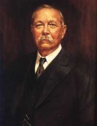

Welcome to our Novels section. You will find the novels of [Sir Arthur Conan Doyle](http://sirconandoyle.com/biography-of-sir-arthur-conan-doyle/ "Biography of Sir Arthur Conan Doyle") here. These are the novels we currently have for your reading pleasure:

## [The Lost World](http://sirconandoyle.com/the-lost-world/ "The Lost World by Sir Arthur Conan Doyle")

This novel, written by Sir Arthur Conan Doyle in 1912, tells of Professor Edward George Challenger's quest for dinosaurs in a prehistoric lost world.

## [The Captain of the Polestar and Other Tales](http://sirconandoyle.com/captain-polestar-tales/ "The Captain Of The Polestar And Other Tales")

This novel, written by Sir Arthur Conan Doyle in 1890, is a collection of 10 short stories.

## [The Crime of the Congo](http://sirconandoyle.com/crime-congo/ "The Crime of the Congo")

Doyle documents the atrocities committed in the Congo Free State, the personal possession of Leopold II of Belgium.

## [The Dealings of Captain Sharkey and Other Tales of Pirates](http://sirconandoyle.com/dealings-captain-sharkey-tales-pirates/ "The Dealings of Captain Sharkey and Other Tales of Pirates")

A book of pirate stories representing some of Conan Doyle's non-Sherlock-Holmes writings.

## [The Stark Munro Letters](http://sirconandoyle.com/stark-munro-letters/ "The Stark Munro Letters")

The letters of Mr. Stark Munro, narrated by Sir Arthur Conan Doyle.

## [The Croxley Master: A Great Tale Of The Prize Ring](http://sirconandoyle.com/croxley-master/ "The Croxley Master – A Great Tale of the Prize Ring")

A young Welsh medical student enters the boxing ring to fight for a £200 prize which will enable him to establish his own practice.

## [The Mystery of Cloomber](http://sirconandoyle.com/mystery-cloomber/ "The Mystery of Cloomber")

The Mystery of Cloomber is a novel by British author Sir Arthur Conan Doyle. It is narrated by John Fothergill West, a Scot who has moved with his family from Edinburgh to Wigtownshire to care for the estate of his father’s half brother, William Farintosh. It was first published in 1889.

## [The Firm of Girdlestone](http://sirconandoyle.com/firm-girdlestone/)

John Girdlestone owns the firm of Girdlestone. It is a very lucrative business and John Girdlestone and his son Ezra Girdlestone are respected by everyone. Both father and son are cynics and have no other thought but for their business; after giving a donation of £25 for charity, John Girdlestone remarks to himself that it is not a bad "investment", as it will make a favorable impression on the collector, who is a Member of Parliament, whose influence he hopes to use some day.

## [The Poison Belt](http://sirconandoyle.com/the-poison-belt/)

The Poison Belt was the second story, a novella, that Sir Arthur Conan Doyle wrote about Professor Challenger. Written in 1913, roughly a year before the outbreak of World War I, much of it takes place in a single room in Challenger's house in Sussex – rather oddly, given that it follows The Lost World, a story set largely outdoors in the wilds of South America. This would be the last story written about Challenger until the 1920s, by which time Doyle's spiritualist beliefs had begun to influence his writing.

## [Tales of Terror and Mystery](https://sirconandoyle.com/tales-terror-mystery/)

Tales of Terror and Mystery is a collection of 12 stories written by Sir Arthur Conan Doyle in 1923. In some of the stories in “Tales of Terror and Mystery”, a suppressed uneasiness gradually builds up and evolves into sheer terror. In others, the story line unexpectedly changes and comes to a horrific conclusion. All stories definitely promise you an entire world of intriguing characters written in Sir Arthur Conan Doyle’s typical genius style.

## [Beyond the City](https://sirconandoyle.com/beyond-the-city/)

Beyond the City is a novel written by Sir Arthur Conan Doyle and published in 1892.

## [My Friend the Murderer](https://sirconandoyle.com/my-friend-the-murderer-and-other-stories/)

‘My Friend the Murderer’ is a short story by Sherlock Holmes creator Sir Arthur Conan Doyle. Our narrator is a doctor who works at an Australian prison. The doctor is urged to take some time to speak to inmate 82, a man named Maloney whose villainous reputation precedes him. As the doctor gets to know him, he is shocked by what Maloney has to say. A gripping short story from the popular author.
