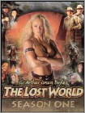
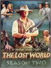
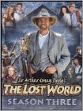
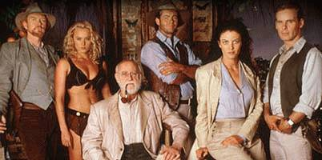
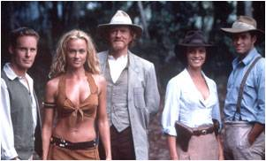
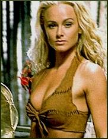
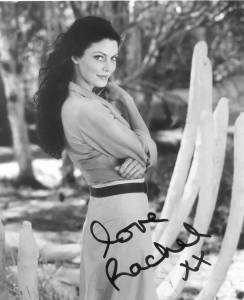
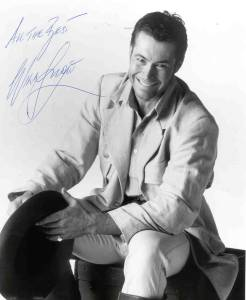

**Status**: Ended **Premiered**: April 1, 1999 **Last Aired**: May 1, 2002 **Show Categories**: Action/Adventure, Drama

_"Sir Arthur Conan Doyle's The Lost World"_ was a syndicated television series. It was only loosely based on his original novel (1912), mainly sharing only its title, basic premise, and some character names.

It ran for three seasons. For the most part the series was filmed in Australia. However due to Australian tax laws, a production could only include so many non-Australians and still qualify for benefits. The series was finally cancelled in 2002 after funding for a fourth season fell through.

All three seasons were released in DVD box sets through 2004.

 

### The Plot

The voice over from the opening credits states **the premise** of the series:

> "At the dawn of the last century, a band of explorers searched for a prehistoric world, driven by ambition, secret desires, a thirst for adventure, and seeking the ultimate story, they are befriended by an untamed beauty. Stranded in a strange and savage land, each day is a desperate search, for a way out, of The Lost World."

The series began at pretty much the same place as the book, where Professor George Challenger (Peter McCauley) is coming under fire from his scientific peers, including Professor Summerlee (Michael Sinelnikoff, who was to be unceremoniously booted from the show at the end of season 1), for his claims about living dinosaurs.

Determined to prove the worth of his claims Challenger sets up an expedition. He is joined by Summerlee, reporter Ned Malone (David Orth) and Lord John Roxton (Will Snow). The final character to join the band of (not so merry) expeditors is an unscrupulous female socialite named Marguerite Krux (Rachel Blakely), who finances the expedition for mysterious and dubious reasons.

Upon reaching the hidden plateau via the balloon used to escape attacking cannibals, the first thing the expedition meets is the true star and special effect of the show, Veronica (Jennifer O'Dell). A regular little "Tarzan-lady" her parents found the lost world but died, leaving her stranded and forced to survive, build a tree house, make a leather bikini (I can never figure out what it is about living in the wild that requires one to wear as little clothes as possible) and learn English all on her own (Sir Conan must have rolled in his grave).

Thanks to her, the group has a base and the necessary experience to face the dangers of this lost land where each day brings a new adventure or trial - they have to work together to defeat; hostile tribes, dinosaurs, witches, supernatural occurrences...everything that goes to make up the wonderful, frightening and magical place that is, 'The Lost World'.

### The Cast

 (Left-Right: David Orth, Jennifer O'Dell, Peter McCauley, Rachel Blakely, William Snow)

The Main Cast comprised of: (source [IMDB](http://www.imdb.com/title/tt0240278/))

David Orth - Ned Malone Jennifer O'Dell - Veronica Peter McCauley - Professor George Challenger Rachel Blakely - Marguerite Will Snow - Lord John Roxton

**Others:**

Michael Sinelnikoff - Professor SummerleeWilliam de Vry - Ned Malone (Pilot – 1999)Lara Cox – Finn (recurring role)Jerome Ehlers – Tribune (recurring role)

### Trivia:

- The series has added the characters of Marguerite and Veronica, there were no women on the expedition in Doyles' book.
- Michael Sinelnikoff played Professor Summerlee in two different versions of _The Lost World_. Besides playing Challenger's foil in the first season of the series, he also played opposite Patrick Bergin's Challenger in the terrible 1998 direct-to-video film version. In it, he managed to die as well.
- The producers of the show have revealed some details of a long-ago proposed fourth season. If the subsequent season had been produced, fans would have learned that Professor Arthur Summerlee was indeed alive, residing in Avalon. Veronica's mother Abigail Layton was also alive and had become the Plateau's protector soon after her disappearance. She became the ruler of Avalon and had left behind a triangle artifact for her daughter Veronica to find. At the epilogue of the Season Three Finale, Veronica was to become the new Protector of the Plateau. Her treehouse dwelling was apparently the epicenter of the entire Plateau. It would have been revealed that Marguerite and Roxton were always meant to be together.
- The Official Site: [http://www.lostworldtv.net](http://www.lostworldtv.net/) has interesting Behind the scenes making of the dinos:  T-Rex, Pterandon & Velociraptor.

Though some male viewers may argue that **Veronica's bathing scenes** were the best thing about the series, I really enjoyed the hot-cold chemistry and the quirky lines between Marguerite and Roxton.

### Quotes:

Here are some of my favorite **Marguerite and Roxton** quotes:

**Marguerite:** So, Roxton, just curious. Why did you risk your life for me with that dinosaur? **Roxton:** Hmmm, must have thought you were someone else.

\*\*

**Marguerite:** The boy’s done us proud.  They grow up so fast these days. **Roxton:** How motherly of you.  I wouldn’t have thought there was a maternal bone in your body. **Marguerite:** How little you know me.  On the other hand, why would I need children when I have you?

\*\*

**Roxton:** What's the big discussion about? **Marguerite:** They're trying to decide which one of us to dine on first. They think I'd be the most tender. **Roxton:** Well they obviously don't know you very well

\*\*

**Marguerite:** All he does these days is watch the skies for Veronica. **Roxton:** Well, surely we owe her that much.  Without Veronica’s treehouse and her parents supplies, why we’d all be wearing raptor skins, living in caves and conversing in grunts. **Marguerite:** Well, what makes you think that’s not how you boys communicate now?

\*\*

**Marguerite:** That’s it, my love. **Roxton:** What did you just say, Marguerite? **Marguerite:** Nothing, nothing!  You must have been dreaming.

\*\*

**Roxton:** You know, sometimes Marguerite's afraid of me just as you are. That makes me think maybe, someone once broke her heart, same way your heart's been broken and she's still not ready to risk that happening again.Mayleen: Did someone ever break your heart? **Roxton:** Oh, I've never met the woman that could break my heart…till I met Marguerite.

\*\*

**Marguerite:** John, please, if you get shot… **Roxton:** If I get shot, what? **Marguerite:** I won't have anyone to antagonize, my life would be quite dull.

\*\*

**Marguerite:** Say something, say something… **Roxton:** What's a nice girl like you, doing in a place like this?

\*\*

**Marguerite:** What is the matter with you? You're behaving like a jealous schoolboy! **Roxton:** Jealous, I am not! However, your infuriating habit of fawning over every man you meet does leave me a trifle weary

\*\*

**Marguerite:** What?! **Roxton:** Oh I was just remembering that delightful little mole you have right by… **Marguerite:** Stop there!  Right now. **Roxton:** As you command, my Contesse. **Marguerite:** Command.  You want a command? (She whispers into his ear) **Roxton:** I don’t know if that’s physically possible. (Marguerite bows mockingly)  Certainly not ladylike.

\*\*

**Roxton:** So much for Prince Charming. **Marguerite:** Actually, he was quite charming when he wanted to be. **Roxton:** Sorry we interrupted you. **Marguerite:** Yes, I’ll bet you are.

\*\*

**Roxton:** No, I won’t believe it. **Marguerite:** Grow up, Roxton.  We all have a price. **Roxton:** You mean _you_ do.

\*\*

**Roxton:** Body heat? **Marguerite:** I’m familiar with the concept. **Roxton:** Well, be my guest.

\*\*

**Roxton:** I thought I told you to stay in the tent. **Marguerite:** Does the phrase, ‘ungrateful son of a bitch’ have a familiar ring?

\*\*

**Marguerite:** Thank you for coming back for me. **Roxton:** You think I did what I did to save your life?  You don’t get it do you?  I was a coward, Marguerite. **Marguerite:** No. No. **Roxton:** You know, it wasn’t death I was afraid of, it was not living. I couldn’t believe it was over.  My life.  My life!  What, that was it?  Can’t be.  And then, it wasn’t. **Marguerite:** You’re not a coward, John, just human.  Welcome to the planet.

\*\*

**Roxton:** An extra rifle.  It’s fully loaded. **Marguerite:** Lord Roxton, someone would think you cared. **Roxton:** I do.
