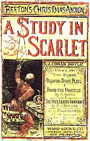
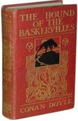

Here you will be able to read the four novels of Sherlock Holmes written by [Sir Arthur Conan Doyle](/oldsite/html/index.php). These books formed a part of [the Canon](http://sirconandoyle.com/the-canon/ "The Canon").

All the books below have been neatly divided by chapter for easy reading. Follow the links below:

### [A Study in Scarlet](http://sirconandoyle.com/a-study-in-scarlet/ "A Study in Scarlet by Sir Arthur Conan Doyle")

 

### [The Sign of Four](http://sirconandoyle.com/the-sign-of-four/ "The Sign of Four by Sir Arthur Conan Doyle")

### [The Hound of the Baskervilles](/the-hound-of-the-baskervilles/)

### [The Valley of Fear](/oldsite/canon/novels/valley/index.php)

