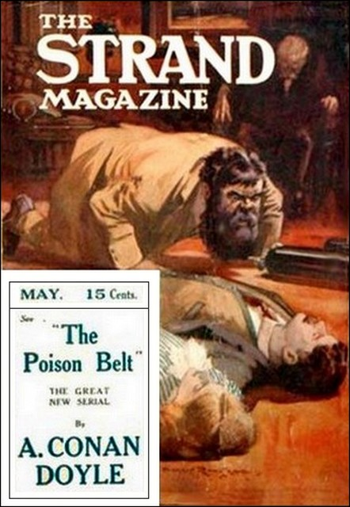

The Poison Belt was the second story, a novella, that Sir Arthur Conan Doyle wrote about Professor Challenger. Written in 1913, roughly a year before the outbreak of World War I, much of it takes place in a single room in Challenger's house in Sussex – rather oddly, given that it follows The Lost World, a story set largely outdoors in the wilds of South America. This would be the last story written about Challenger until the 1920s, by which time Doyle's spiritualist beliefs had begun to influence his writing.

\[caption id="attachment\_1709" align="alignnone" width="442"\] The Poison Belt - The Strand Magazine, US edition, May 1913. Source: Project Gutenberg Australia\[/caption\]

**Being an account of another adventure of Prof. George E. Challenger, Lord John Roxton, Prof. Summerlee, and Mr. E. D. Malone, the discoverers of "The Lost World"**

## TABLE OF CONTENTS

1. [THE BLURRING OF LINES](http://sirconandoyle.com/the-blurring-of-lines/)
2. [THE TIDE OF DEATH](http://sirconandoyle.com/tide-of-death/)
3. [SUBMERGED](http://sirconandoyle.com/poison-belt-submerged/)
4. [A DIARY OF THE DYING](http://sirconandoyle.com/poisen-belt-diary-dying/)
5. [THE DEAD WORLD](http://sirconandoyle.com/poison-belt-dead-world/)
6. [THE GREAT AWAKENING](http://sirconandoyle.com/poison-belt-great-awakening/)
