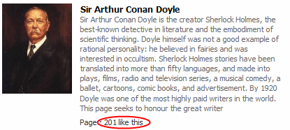

In less than 3 months since crossing [the 100 mark](http://sirconandoyle.com/sir-arthur-conan-doyle-on-facebook/), the number of fans on Facebook has crossed 200!

I've also had a chance to revamp the theme to make the posts more readable. I still need to tweak a few things around to make it better.

The [The Memoirs of Sherlock Holmes](../the-memoirs-of-sherlock-holmes/) and [The Adventures of Sherlock Holmes](../the-adventures-of-sherlock-holmes/) are now online in the new template, while other books of [The Canon](http://sirconandoyle.com/the-canon/) are still available in the old site.

We have a [RSS feed](http://sirconandoyle.com/feed/) set up which will allow you to read the new posts in your favourite news reader.

If you're an advertiser, you can [purchase a text links](http://sirconandoyle.com/wp-content/plugins/oiopub-direct/purchase.php?do=link&zone=1) that will show up in the sidebar.
