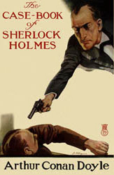

**The Case-Book of Sherlock Holmes** is the last collection of 12 short stories written by [Sir Arthur Conan Doyle](/sirconandoyle/oldsite/html/index.php) in 1927. It contains stories published between 1921 and 1927.

- [Preface](/sirconandoyle/canon/casebook/preface-of-the-case-book-of-sherlock-holmes/)
- [The Adventure of the Illustrious Client](/sirconandoyle/adventure-illustrious-client/%20%22The%20Adventure%20of%20the%20Illustrious%20Client%22/)
- [The Adventure of the Blanched Soldier](/sirconandoyle/adventure-blanched-soldier/%20%22The%20Adventure%20of%20the%20Blanched%20Soldier%22/)
- [The Adventure of the Mazarin Stone](/sirconandoyle/adventure-mazarin-stone/%20%22The%20Adventure%20of%20the%20Mazarin%20Stone%22/)
- [The Adventure of the Three Gables](/sirconandoyle/adventure-gables/%20%22The%20Adventure%20of%20the%20Three%20Gables%22/)
- [The Adventure of the Sussex Vampire](/sirconandoyle/adventure-sussex-vampire/%20%22The%20Adventure%20of%20the%20Sussex%20Vampire%22/)
- [The Adventure of the Three Garridebs](/sirconandoyle/adventure-garridebs/%20%22The%20Adventure%20of%20the%20Three%20Garridebs%22/)
- [The Problem of Thor Bridge](/sirconandoyle/canon/casebook/problem-thor-bridge/)
- [The Adventure of the Creeping Man](/sirconandoyle/canon/casebook/adventure-creeping-man/)
- [The Adventure of the Lion's Mane](/sirconandoyle/canon/casebook/adventure-lions-mane/)
- [The Adventure of the Veiled Lodger](/sirconandoyle/canon/casebook/the-adventure-of-the-veiled-lodger/)
- [The Adventure of Shoscombe Old Place](/sirconandoyle/canon/casebook/the-adventure-of-shoscombe-old-place/)
- [The Adventure of the Retired Colourman](/sirconandoyle/canon/casebook/the-adventure-of-the-retired-colourman/)
