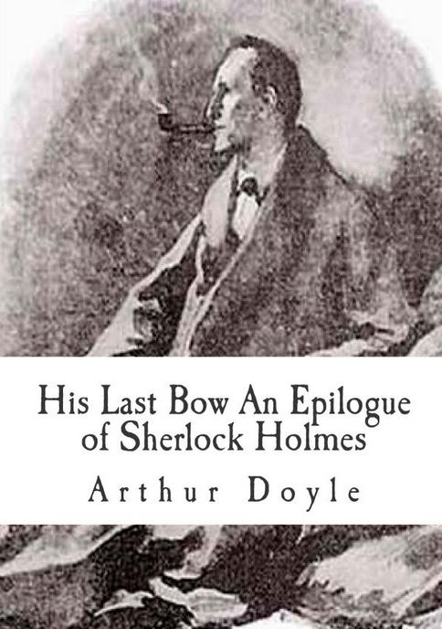

**His Last Bow** is a collection of eight short stories featuring Sherlock Holmes and written by [Sir Arthur Conan Doyle](/sirconandoyle/biography-of-sir-arthur-conan-doyle/). Published in 1917, it contains the stories published between 1908 and 1917.

## Table of Contents

- [The Adventure of Wisteria Lodge](/sirconandoyle/adventure-wisteria-lodge/%20%22The%20Adventure%20of%20Wisteria%20Lodge%22/)
- [The Adventure of the Cardboard Box](/sirconandoyle/adventure-cardboard-box/%20%22The%20Adventure%20of%20the%20Cardboard%20Box%22/)
- [The Adventure of the Red Circle](/sirconandoyle/adventure-red-circle/%20%22The%20Adventure%20of%20the%20Red%20Circle%22/)
- [The Adventure of the Bruce-Partington Plans](/sirconandoyle/adventure-bruce-partington-plans/%20%22The%20Adventure%20of%20the%20Bruce-Partington%20Plans%22/)
- [The Adventure of the Dying Detective](/sirconandoyle/adventure-dying-detective/%20%22The%20Adventure%20of%20the%20Dying%20Detective%22/)
- [The Disappearance of Lady Francis Carfax](/sirconandoyle/disappearance-lady-frances-carfax/%20%22The%20Disappearance%20of%20Lady%20Frances%20Carfax%22/)
- [The Adventure of the Devil's Foot](/sirconandoyle/adventure-devils-foot/%20%22The%20Adventure%20of%20the%20Devil%E2%80%99s%20Foot%22/)
- [His Last Bow](/sirconandoyle/bow-epilogue-sherlock-holmes/%20%22His%20Last%20Bow:%20An%20Epilogue%20of%20Sherlock%20Holmes%22/)
