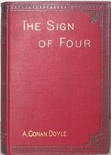

**The Sign of Four**, was written for the **Lippincott's Magazine** by [Sir Arthur Conan Doyle](/sirconandoyle/about/) in 1890. This was the second Sherlock Holmes novel.

The story collects a colorful group of people together, among them Jonathan Small who has a wooden leg and a dwarf from Tonga islands.

Chapter 1 - [The Science of Deduction](/sirconandoyle/science-deduction-2/%20%22The%20Sign%20of%20Four%20%E2%80%93%20Chapter%201:%20The%20Science%20of%20Deduction%22/)

Chapter 2 - [The Statement of the Case](/sirconandoyle/statement-case/%20%22The%20Sign%20of%20Four%20%E2%80%93%20Chapter%202:%20The%20Statement%20of%20the%20Case%22/)

Chapter 3 - [In Quest of a Solution](/sirconandoyle/quest-solution/%20%22The%20Sign%20of%20Four%20%E2%80%93%20Chapter%203:%20In%20Quest%20of%20a%20Solution%22/)

Chapter 4 - [The Story of the Bald-headed Man](/sirconandoyle/story-bald-headed-man/%20%22The%20Sign%20of%20Four%20%E2%80%93%20Chapter%204:%20The%20Story%20of%20the%20Bald-headed%20Man%22/)

Chapter 5 - [The Tragedy of Pondicherry Lodge](/sirconandoyle/tragedy-pondicherry-lodge/%20%22The%20Sign%20of%20Four%20%E2%80%93%20Chapter%205:%20The%20Tragedy%20of%20Pondicherry%20Lodge%22/)

Chapter 6 - [Sherlock Holmes gives a demonstration](/sirconandoyle/sherlock-holmes-demonstration/%20%22The%20Sign%20of%20Four%20%E2%80%93%20Chapter%206:%20Sherlock%20Holmes%20gives%20a%20Demonstration%22/)

Chapter 7 - [The Episode of the Barrel](/sirconandoyle/episode-barrel/%20%22The%20Sign%20of%20Four%20%E2%80%93%20Chapter%207:%20The%20Episode%20of%20the%20Barrel%22/)

Chapter 8 - [The Baker Street Irregulars](/sirconandoyle/baker-street-irregulars/%20%22The%20Sign%20of%20Four%20%E2%80%93%20Chapter%208:%20The%20Baker%20Street%20Irregulars%22/)

Chapter 9 - [A Break in the Chain](/sirconandoyle/break-chain/%20%22The%20Sign%20of%20Four%20%E2%80%93%20Chapter%209:%20Break%20in%20the%20Chain%22/)

Chapter 10 - [The End of the Islander](/sirconandoyle/islander/%20%22The%20Sign%20of%20Four%20%E2%80%93%20Chapter%2010:%20The%20End%20of%20the%20Islander%22/)

Chapter 11 - [The Great Agra Treasure](/sirconandoyle/great-agra-treasure/%20%22The%20Sign%20of%20Four%20%E2%80%93%20Chapter%2011:%20The%20Great%20Agra%20Treasure%22/)

Chapter 12 - [The Strange Story of Jonathan Small](/sirconandoyle/strange-story-jonathan-small/%20%22The%20Sign%20of%20Four%20%E2%80%93%20Chapter%2012:%20The%20Strange%20Story%20of%20Jonathan%20Small%22/)

\[Image source: [Wikipedia](http://en.wikipedia.org/wiki/File:TheSignOfTheFour.jpg)\]
