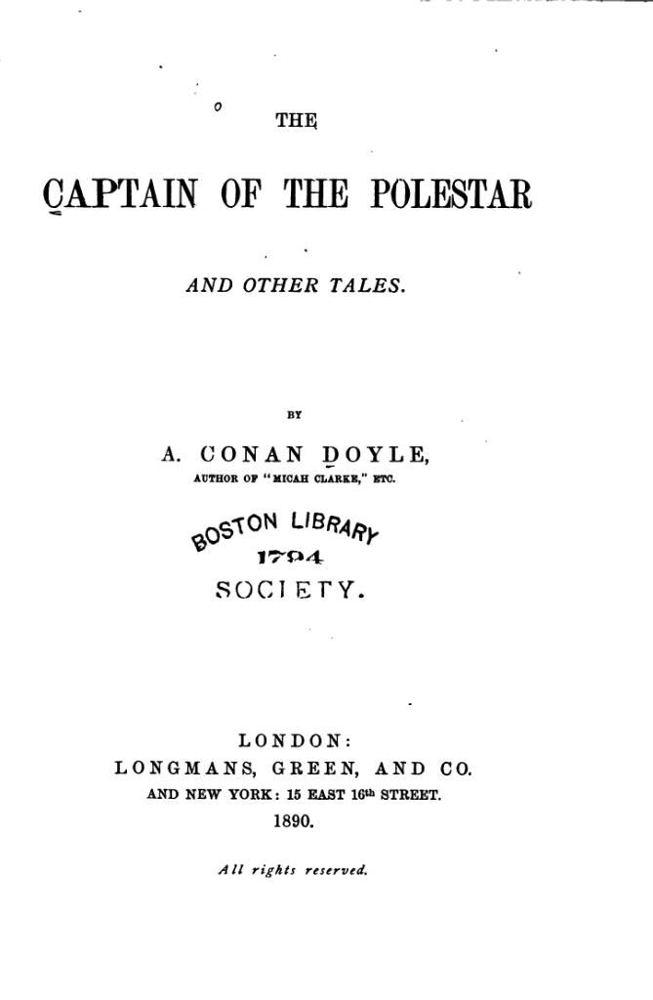

To my friend major-general A. W. Drayson as a slight token of my admiration for his great and as yet unrecognised services to astronomy _this little volume_ is dedicated

## Preface

For the use of some of the following Tales I am indebted to the courtesy of the Proprietors of "Cornhill", "Temple Bar", "Belgravia", "London Society", "Cassell's" and "The Boy's Own Paper."

A. Conan Doyle, M.D.

## Contents:

- [The Captain Of The Pole-star](/sirconandoyle/captain-polestar/%20%22The%20Captain%20of%20the%20Polestar%22/)
- [J. Habakuk Jephson's Statement](/sirconandoyle/f-habakuk-jephsons-statement/%20%22F.%20Habakuk%20Jephson%E2%80%99s%20Statement%22/)
- [The Great Keinplatz Experiment](/sirconandoyle/great-keinplatz-experiment/%20%22The%20Great%20Keinplatz%20Experiment%22/)
- [The Man From Archangel](/sirconandoyle/man-archangel/%20%22The%20Man%20From%20Archangel%22/)
- [That Little Square Box](/sirconandoyle/square-box/%20%22That%20Little%20Square%20Box%22/)
- [John Huxford's Hiatus](/sirconandoyle/john-huxfords-hiatus/%20%22John%20Huxford%E2%80%99s%20Hiatus%22/)
- [A Literary Mosaic](/sirconandoyle/literary-mosaic/%20%22A%20Literary%20Mosaic%22/)
- [John Barrington Cowles](/sirconandoyle/john-barrington-cowles/%20%22John%20Barrington%20Cowles%22/)
- [The Parson Of Jackman's Gulch](/sirconandoyle/parson-jackmans-gulch/%20%22The%20Parson%20Of%20Jackman%E2%80%99s%20Gulch%22/)
- [The Ring Of Thoth](/sirconandoyle/ring-thoth/%20%22The%20Ring%20Of%20Thoth%22/)

## Download or Purchase from Amazon

There are several versions available of the book to read either on your Kindle or in a paper back version. [Get The Captain of the Polestar from Amazon](http://www.amazon.com/s/?_encoding=UTF8&camp=1789&creative=390957&field-keywords=The%20Captain%20of%20The%20Polestar&linkCode=ur2&tag=sirconandoyle-20&url=search-alias%3Dstripbooks).

_Image source: By Arthur Conan Doyle (1859–1930) \[Public domain or Public domain\], [via Wikimedia Commons](https://commons.wikimedia.org/wiki/File%3ACaptain_of_the_Polestar.djvu)_
