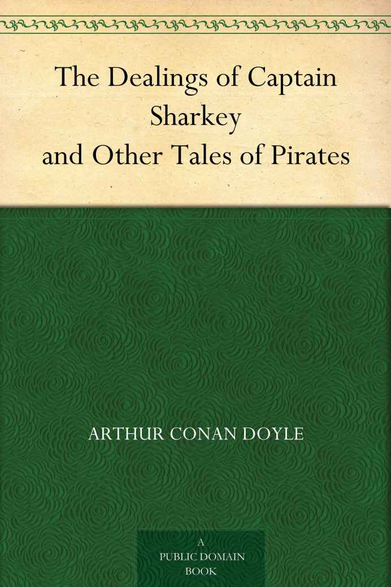

Careening was a very necessary operation for the old pirate. On his superior speed he depended both for overhauling the trader and escaping the man-of-war. But it was impossible to retain his sailing qualities unless he periodically—once a year, at the least—cleared his vessel's bottom from the long, trailing plants and crusting barnacles which gather so rapidly in the tropical seas.

For this purpose he lightened his vessel, thrust her into some narrow inlet where she would be left high and dry at low water, fastened blocks and tackles to her masts to pull her over on to her bilge, and then scraped her thoroughly from rudder-post to cutwater.

During the weeks which were thus occupied the ship was, of course, defenceless; but, on the other hand, she was unapproachable by anything heavier than an empty hull, and the place for careening was chosen with an eye to secrecy, so that there was no great danger.

So secure did the captains feel, that it was not uncommon for them, at such times, to leave their ships under a sufficient guard and to start off in the long-boat, either upon a sporting expedition or, more frequently, upon a visit to some outlying town, where they turned the heads of the women by their swaggering gallantry, or broached pipes of wine in the market square, with a threat to pistol all who would not drink with them.

Sometimes they would even appear in cities of the size of Charleston, and walk the streets with their clattering sidearms—an open scandal to the whole law-abiding colony. Such visits were not always paid with impunity. It was one of them, for example, which provoked Lieutenant Maynard to hack off Blackbeard's head, and to spear it upon the end of his bowsprit. But, as a rule, the pirate ruffled and bullied and drabbed without let or hindrance, until it was time for him to go back to his ship once more.

There was one pirate, however, who never crossed even the skirts of civilisation, and that was the sinister Sharkey, of the barque _Happy Delivery_. It may have been from his morose and solitary temper, or, as is more probable, that he knew that his name upon the coast was such that outraged humanity would, against all odds, have thrown themselves upon him, but never once did he show his face in a settlement.

When his ship was laid up he would leave her under the charge of Ned Galloway—her New England quartermaster—and would take long voyages in his boat, sometimes, it was said, for the purpose of burying his share of the plunder, and sometimes to shoot the wild oxen of Hispaniola, which, when dressed and barbecued, provided provisions for his next voyage. In the latter case the barque would come round to some pre-arranged spot to pick him up and take on board what he had shot.

There had always been a hope in the islands that Sharkey might be taken on one of these occasions; and at last there came news to Kingston which seemed to justify an attempt upon him. It was brought by an elderly logwood-cutter who had fallen into the pirate's hands, and in some freak of drunken benevolence had been allowed to get away with nothing worse than a slit nose and a drubbing. His account was recent and definite. The _Happy Delivery_ was careening at Torbec on the south-west of Hispaniola. Sharkey, with four men, was buccaneering on the outlying island of La Vache. The blood of a hundred murdered crews was calling out for vengeance, and now at last it seemed as if it might not call in vain.

Sir Edward Compton, the high-nosed, red-faced Governor, sitting in solemn conclave with the commandant and the head of the council, was sorely puzzled in his mind as to how he should use his chance. There was no man-of-war nearer than Jamestown, and she was a clumsy old fly-boat, which could neither overhaul the pirate on the seas, nor reach her in a shallow inlet. There were forts and artillerymen both at Kingston and Port Royal, but no soldiers available for an expedition.

A private venture might be fitted out—and there were many who had a blood-feud with Sharkey—but what could a private venture do? The pirates were numerous and desperate. As to taking Sharkey and his four companions, that, of course, would be easy if they could get at them; but how were they to get at them on a large well-wooded island like La Vache, full of wild hills and impenetrable jungles? A reward was offered to whoever could find a solution, and that brought a man to the front who had a singular plan, and was himself prepared to carry it out.

Stephen Craddock had been that most formidable person, the Puritan gone wrong. Sprung from a decent Salem family, his ill-doing seemed to be a recoil from the austerity of their religion, and he brought to vice all the physical strength and energy with which the virtues of his ancestors had endowed him. He was ingenious, fearless, and exceedingly tenacious of purpose, so that when he was still young his name became notorious upon the American coast.

He was the same Craddock who was tried for his life in Virginia for the slaying of the Seminole Chief, and, though he escaped, it was well known that he had corrupted the witnesses and bribed the judge.

Afterwards, as a slaver, and even, as it was hinted, as a pirate, he had left an evil name behind him in the Bight of Benin. Finally he had returned to Jamaica with a considerable fortune, and had settled down to a life of sombre dissipation. This was the man, gaunt, austere, and dangerous, who now waited upon the Governor with a plan for the extirpation of Sharkey.

Sir Edward received him with little enthusiasm, for in spite of some rumours of conversion and reformation, he had always regarded him as an infected sheep who might taint the whole of his little flock. Craddock saw the Governor's mistrust under his thin veil of formal and restrained courtesy.

"You've no call to fear me, sir," said he; "I'm a changed man from what you've known. I've seen the light again, of late, after losing sight of it for many a black year. It was through the ministration of the Rev. John Simons, of our own people. Sir, if your spirit should be in need of quickening, you would find a very sweet savour in his discourse."

The Governor cocked his Episcopalian nose at him.

"You came here to speak of Sharkey, Master Craddock," said he.

"The man Sharkey is a vessel of wrath," said Craddock. "His wicked horn has been exalted over long, and it is borne in upon me that if I can cut him off and utterly destroy him, it will be a goodly deed, and one which may atone for many backslidings in the past. A plan has been given to me whereby I may encompass his destruction."

The Governor was keenly interested, for there was a grim and practical air about the man's freckled face which showed that he was in earnest. After all, he was a seaman and a fighter, and, if it were true that he was eager to atone for his past, no better man could be chosen for the business.

"This will be a dangerous task, Master Craddock," said he.

"If I meet my death at it, it may be that it will cleanse the memory of an ill-spent life. I have much to atone for."

The Governor did not see his way to contradict him.

"What was your plan?" he asked.

"You have heard that Sharkey's barque, the _Happy Delivery_, came from this very port of Kingston?"

"It belonged to Mr. Codrington, and it was taken by Sharkey, who scuttled his own sloop and moved into her because she was faster," said Sir Edward.

"Yes; but it may be that you have never heard that Mr. Codrington has a sister ship, the _White Rose_, which lies even now in the harbour, and which is so like the pirate, that, if it were not for a white paint line, none could tell them apart."

"Ah! and what of that?" asked the Governor keenly, with the air of one who is just on the edge of an idea.

"By the help of it this man shall be delivered into our hands."

"And how?"

"I will paint out the streak upon the _White Rose_, and make it in all things like the _Happy Delivery_. Then I will set sail for the Island of La Vache, where this man is slaying the wild oxen. When he sees me he will surely mistake me for his own vessel which he is awaiting, and he will come on board to his own undoing."

It was a simple plan, and yet it seemed to the Governor that it might be effective. Without hesitation he gave Craddock permission to carry it out, and to take any steps he liked in order to further the object which he had in view. Sir Edward was not very sanguine, for many attempts had been made upon Sharkey, and their results had shown, that he was as cunning as he was ruthless. But this gaunt Puritan with the evil record was cunning and ruthless also.

The contest of wits between two such men as Sharkey and Craddock appealed to the Governor's acute sense of sport, and though he was inwardly convinced that the chances were against him, he backed his man with the same loyalty which he would have shown to his horse or his cock.

Haste was, above all things, necessary, for upon any day the careening might be finished, and the pirates out at sea once more. But there was not very much to do, and there were many willing hands to do it, so the second day saw the _White Rose_ beating out for the open sea. There were many seamen in the port who knew the lines and rig of the pirate barque, and not one of them could see the slightest difference in this counterfeit. Her white side line had been painted out, her masts and yards were smoked, to give them the dingy appearance of the weather-beaten rover, and a large diamond shaped patch was let into her fore-topsail.

Her crew were volunteers, many of them being men who had sailed with Stephen Craddock before—the mate, Joshua Hird, an old slaver, had been his accomplice in many voyages, and came now at the bidding of his chief.

The avenging barque sped across the Caribbean Sea, and, at the sight of that patched topsail, the little craft which they met flew left and right like frightened trout in a pool. On the fourth evening Point Abacou bore five miles to the north and east of them.

On the fifth they were at anchor in the Bay of Tortoises at the Island of La Vache, where Sharkey and his four men had been hunting. It was a well-wooded place, with the palms and underwood growing down to the thin crescent of silver sand which skirted the shore. They had hoisted the black flag and the red pennant, but no answer came from the shore. Craddock strained his eyes, hoping every instant to see a boat shoot out to them with Sharkey seated in the sheets. But the night passed away, and a day and yet another night, without any sign of the men whom they were endeavouring to trap. It looked as if they were already gone.

On the second morning Craddock went ashore in search of some proof whether Sharkey and his men were still upon the island. What he found reassured him greatly. Close to the shore was a boucan of green wood, such as was used for preserving the meat, and a great store of barbecued strips of ox-flesh was hung upon lines all round it. The pirate ship had not taken off her provisions, and therefore the hunters were still upon the island.

Why had they not shown themselves? Was it that they had detected that this was not their own ship? Or was it that they were hunting in the interior of the island, and were not on the lookout for a ship yet? Craddock was still hesitating between the two alternatives, when a Carib Indian came down with information. The pirates were in the island, he said, and their camp was a day's march from the sea. They had stolen his wife, and the marks of their stripes were still pink upon his brown back. Their enemies were his friends, and he would lead them to where they lay.

Craddock could not have asked for anything better; so early next morning, with a small party armed to the teeth, he set off under the guidance of the Carib. All day they struggled through brushwood and clambered over rocks, pushing their way further and further into the desolate heart of the island. Here and there they found traces of the hunters, the bones of a slain ox, or the marks of feet in a morass, and once, towards evening, it seemed to some of them that they heard the distant rattle of guns.

That night they spent under the trees, and pushed on again with the earliest light. About noon they came to the huts of bark, which, the Carib told them, were the camp of the hunters, but they were silent and deserted. No doubt their occupants were away at the hunt and would return in the evening, so Craddock and his men lay in ambush in the brushwood around them. But no one came, and another night was spent in the forest. Nothing more could be done, and it seemed to Craddock that after the two days' absence it was time that he returned to his ship once more.

The return journey was less difficult, as they had already blazed a path for themselves. Before evening they found themselves once more at the Bay of Palms, and saw their ship riding at anchor where they had left her. Their boat and oars had been hauled up among the bushes, so they launched it and pulled out to the barque.

"No luck, then!" cried Joshua Hird, the mate, looking down with a pale face from the poop.

"His camp was empty, but he may come down to us yet," said Craddock, with his hand on the ladder.

Somebody upon deck began to laugh. "I think," said the mate, "that these men had better stay in the boat."

"Why so?"

"If you will come aboard, sir, you will understand it." He spoke in a curious hesitating fashion.

The blood flushed to Craddock's gaunt face.

"How is this, Master Hird?" he cried, springing up the side. "What mean you by giving orders to my boat's crew?"

But as he passed over the bulwarks, with one foot upon the deck and one knee upon the rail, a tow-bearded man, whom he had never before observed aboard his vessel, grabbed suddenly at his pistol. Craddock clutched at the fellow's wrist, but at the same instant his mate snatched the cutlass from his side.

"What roguery is this?" shouted Craddock looking furiously around him. But the crew stood in little knots about the deck, laughing and whispering amongst themselves without showing any desire to go to his assistance. Even in that hurried glance Craddock noticed that they were dressed in the most singular manner, with long riding-coats, full-skirted velvet gowns and coloured ribands at their knees, more like men of fashion than seamen.

As he looked at their grotesque figures he struck his brow with his clenched fist to be sure that he was awake. The deck seemed to be much dirtier than when he had left it, and there were strange, sun-blackened faces turned upon him from every side. Not one of them did he know save only Joshua Hird. Had the ship been captured in his absence? Were these Sharkey's men who were around him? At the thought he broke furiously away and tried to climb over to his boat, but a dozen hands were on him in an instant, and he was pushed aft through the open door of his own cabin.

And it was all different from the cabin which he had left. The floor was different, the ceiling was different, the furniture was different. His had been plain and austere. This was sumptuous and yet dirty, hung with rare velvet curtains splashed with wine-stains, and panelled with costly woods which were pocked with pistol-marks.

On the table was a great chart of the Caribbean Sea, and beside it, with compasses in his hand, sat a clean-shaven, pale-faced man with a fur cap and a claret-coloured coat of damask. Craddock turned white under his freckles as he looked upon the long, thin, high-nostrilled nose and the red-rimmed eyes which were turned upon him with the fixed, humorous gaze of the master player who has left his opponent without a move.

"Sharkey?" cried Craddock.

Sharkey's thin lips opened and he broke into his high, sniggering laugh.

"You fool!" he cried, and, leaning over, he stabbed Craddock's shoulder again and again with his compasses. "You poor, dull-witted fool, would you match yourself against me?"

It was not the pain of the wounds, but it was the contempt in Sharkey's voice which turned Craddock into a savage madman. He flew at the pirate, roaring with rage, striking, kicking, writhing, and foaming. It took six men to drag him down on to the floor amidst the splintered remains of the table—and not one of the six who did not bear the prisoner's mark upon him. But Sharkey still surveyed him with the same contemptuous eye. From outside there came the crash of breaking wood and the clamour of startled voices.

"What is that?" asked Sharkey.

"They have stove the boat with cold shot, and the men are in the water."

"Let them stay there," said the pirate. "Now, Craddock, you know where you are. You are aboard my ship the _Happy Delivery_, and you lie at my mercy. I knew you for a stout seaman, you rogue, before you took to this long-shore canting. Your hands then were no cleaner than my own. Will you sign articles, as your mate has done, and join us, or shall I heave you over to follow your ship's company?"

"Where is my ship?" asked Craddock.

"Scuttled in the bay."

"And the hands?"

"In the bay, too."

"Hock him and heave him over," said Sharkey.

Many rough hands had dragged Craddock out upon deck, and Galloway, the quartermaster, had already drawn his hangar to cripple him, when Sharkey came hurrying from his cabin with an eager face.

"We can do better with the hound!" he cried. "Sink me if it is not a rare plan. Throw him into the sail-room with the irons on, and do you come here, quartermaster, that I may tell you what I have in my mind."

So Craddock, bruised and wounded in soul and body, was thrown into the dark sail-room, so fettered that he could not stir hand or foot, but his Northern blood was running strong in his veins, and his grim spirit aspired only to make such an ending as might go some way towards atoning for the evil of his life. All night he lay in the curve of the bilge listening to the rush of the water and the straining of the timbers which told him that the ship was at sea, and driving fast. In the early morning some one came crawling to him in the darkness over the heaps of sails.

"Here's rum and biscuits," said the voice of his late mate. "It's at the risk of my life, Master Craddock, that I bring them to you."

"It was you who trapped me and caught me as in a snare!" cried Craddock. "How shall you answer for what you have done?"

"What I did I did with the point of a knife betwixt my blade-bones."

"God forgive you for a coward, Joshua Hird. How came you into their hands?"

"Why, Master Craddock, the pirate ship came back from its careening upon the very day that you left us. They laid us aboard, and, short-handed as we were, with the best of the men ashore with you, we could offer but a poor defence. Some were cut down, and they were the happiest. The others were killed afterwards. As to me, I saved my life by signing on with them."

"And they scuttled my ship?"

"They scuttled her, and then Sharkey and his men, who had been watching us from the brushwood, came off to the ship. His main-yard had been cracked and fished last voyage, so he had suspicions of us, seeing that ours was whole. Then he thought of laying the same trap for you which you had set for him."

Craddock groaned.

"How came I not to see that fished main-yard?" he muttered. "But whither are we bound?"

"We are running north and west."

"North and west! Then we are heading back towards Jamaica."

"With an eight-knot wind."

"Have you heard what they mean to do with me?"

"I have not heard. If you would but sign the articles——"

"Enough, Joshua Hird! I have risked my soul too often."

"As you wish! I have done what I could. Farewell!"

All that night and the next day the _Happy Delivery_ ran before the easterly trades, and Stephen Craddock lay in the dark of the sail-room working patiently at his wrist-irons. One he had slipped off at the cost of a row of broken and bleeding knuckles, but, do what he would, he could not free the other, and his ankles were securely fastened.

From hour to hour he heard the swish of the water, and knew that the barque must be driving with all set, in front of the trade wind. In that case they must be nearly back again to Jamaica by now. What plan could Sharkey have in his head, and what use did he hope to make of him? Craddock set his teeth, and vowed that if he had once been a villain from choice he would, at least, never be one by compulsion.

On the second morning Craddock became aware that sail had been reduced in the vessel, and that she was tacking slowly, with a light breeze on her beam. The varying slope of the sail-room and the sounds from the deck told his practised senses exactly what she was doing. The short reaches showed him that she was man\[oe\]uvring near shore, and making for some definite point. If so, she must have reached Jamaica. But what could she be doing there?

And then suddenly there was a burst of hearty cheering from the deck, and then the crash of a gun above his head, and then the answering booming of guns from far over the water. Craddock sat up and strained his ears. Was the ship in action? Only the one gun had been fired, and though many had answered there were none of the crashings which told of a shot coming home.

Then, if it was not an action, it must be a salute. But who would salute Sharkey, the pirate? It could only be another pirate ship which would do so. So Craddock lay back again with a groan, and continued to work at the manacle which still held his right wrist.

But suddenly there came the shuffling of steps outside, and he had hardly time to wrap the loose links round his free hand, when the door was unbolted and two pirates came in.

"Got your hammer, carpenter?" asked one, whom Craddock recognised as the big quartermaster. "Knock off his leg shackles, then. Better leave the bracelets—he's safer with them on."

With hammer and chisel the carpenter loosened the irons.

"What are you going to do with me?" asked Craddock.

"Come on deck and you'll see."

The sailor seized him by the arm and dragged him roughly to the foot of the companion. Above him was a square of blue sky cut across by the mizzen gaff with the colours flying at the peak. But it was the sight of those colours which struck the breath from Stephen Craddock's lips. For there were two of them, and the British ensign was flying above the Jolly Rodger—the honest flag above that of the rogue.

For an instant Craddock stopped in amazement, but a brutal push from the pirates behind drove him up the companion ladder. As he stepped out upon deck, his eyes turned up to the main, and there again were the British colours flying above the red pennant, and all the shrouds and rigging were garlanded with streamers.

Had the ship been taken, then? But that was impossible, for there were the pirates clustering in swarms along the port bulwarks, and waving their hats joyously in the air. Most prominent of all was the renegade mate, standing on the foc'sle head, and gesticulating wildly. Craddock looked over the side to see what they were cheering at, and then in a flash he saw how critical was the moment.

On the port bow, and about a mile off, lay the white houses and forts of Port Royal, with flags breaking out everywhere over their roofs. Right ahead was the opening of the palisades leading to the town of Kingston. Not more than a quarter of a mile off was a small sloop working out against the very slight wind. The British ensign was at her peak, and her rigging was all decorated. On her deck could be seen a dense crowd of people cheering and waving their hats, and the gleam of scarlet told that there were officers of the garrison among them.

In an instant, with the quick perception of a man of action, Craddock saw through it all. Sharkey, with that diabolical cunning and audacity which were among his main characteristics, was simulating the part which Craddock would himself have played, had he come back victorious. It was in _his_ honour that the salutes were firing and the flags flying. It was to welcome _him_ that this ship with the Governor, the commandant, and the chiefs of the island was approaching. In another ten minutes they would all be under the guns of the _Happy Delivery_, and Sharkey would have won the greatest stake that ever a pirate played for yet.

"Bring him forward," cried the pirate captain, as Craddock appeared between the carpenter and the quartermaster. "Keep the ports closed, but clear away the port guns, and stand by for a broadside. Another two cable lengths and we have them."

"They are edging away," said the boatswain. "I think they smell us."

"That's soon set right," said Sharkey, turning his filmy eyes upon Craddock. "Stand there, you—right there, where they can recognise you, with your hand on the guy, and wave your hat to them. Quick, or your brains will be over your coat. Put an inch of your knife into him, Ned. Now, will you wave your hat? Try him again, then. Hey, shoot him! stop him!"

But it was too late. Relying upon the manacles, the quartermaster had taken his hands for a moment off Craddock's arm. In that instant he had flung off the carpenter and, amid a spatter of pistol bullets, had sprung the bulwarks and was swimming for his life. He had been hit and hit again, but it takes many pistols to kill a resolute and powerful man who has his mind set upon doing something before he dies. He was a strong swimmer, and, in spite of the red trail which he left in the water behind him, he was rapidly increasing his distance from the pirate.

"Give me a musket!" cried Sharkey, with a savage oath.

He was a famous shot, and his iron nerves never failed him in an emergency. The dark head appearing on the crest of a roller, and then swooping down on the other side, was already half-way to the sloop. Sharkey dwelt long upon his aim before he fired. With the crack of the gun the swimmer reared himself up in the water, waved his hands in a gesture of warning, and roared out in a voice which rang over the bay. Then, as the sloop swung round her head-sails, and the pirate fired an impotent broadside, Stephen Craddock, smiling grimly in his death agony, sank slowly down to that golden couch which glimmered far beneath him.
