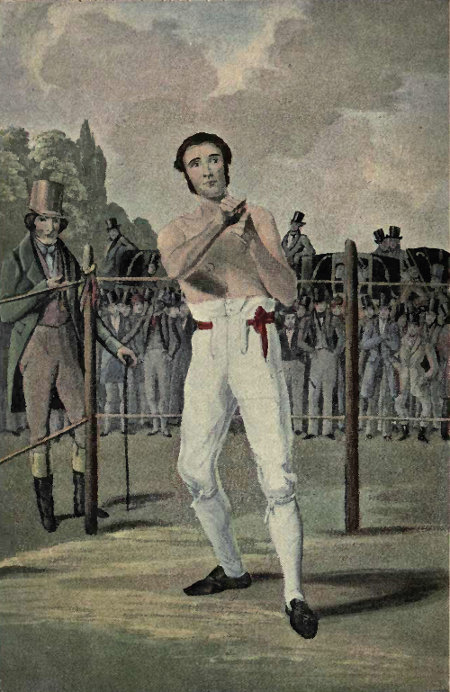

WORK was struck at one o'clock at the coal-pits and the iron-works, and the fight was arranged for three. From the Croxley Furnaces, from Wilson's Coal-pits, from the Heartsease Mine, from the Dodd Mills, from the Leverworth Smelters the workmen came trooping, each with his fox-terrier or his lurcher at his heels. Warped with labour and twisted by toil, bent double by week-long work in the cramped coal galleries, or half-blinded with years spent in front of white-hot fluid metal, these men still gilded their harsh and hopeless lives by their devotion to sport. It was their one relief, the only thing which could distract their mind from sordid surroundings, and give them an interest beyond the blackened circle which inclosed them. Literature, art, science, all these things were beyond the horizon; but the race, the football match, the cricket, the fight, these were things which they could understand, which they could speculate upon in advance and comment upon afterwards. Sometimes brutal, sometimes grotesque, the love of sport is still one of the great agencies which make for the happiness of our people. It lies very deeply in the springs of our nature, and when it has been educated out, a higher, more refined nature may be left, but it will not be of that robust British type which has left its mark so deeply on the world. Every one of these ruddled workers, slouching with his dog at his heels to see something of the fight, was a true unit of his race.

It was a squally May day, with bright sun-bursts and driving showers. Montgomery worked all morning in the surgery getting his medicine made up.

"The weather seems so very unsettled, Mr. Montgomery," remarked the doctor, "that I am inclined to think that you had better postpone your little country excursion until a later date."

"I am afraid that I must go to-day, sir."

"I have just had an intimation that Mrs. Potter, at the other side of Angleton, wishes to see me. It is probable that I shall be there all day. It will be extremely inconvenient to leave the house empty so long."

"I am very sorry, sir, but I must go," said the assistant, doggedly.

The doctor saw that it would be useless to argue, and departed in the worst of bad tempers upon his mission. Montgomery felt easier now that he was gone. He went up to his room, and packed his running-shoes, his fighting-drawers, and his cricket-sash into a handbag. When he came down Mr. Wilson was waiting for him in the surgery.

"I hear the doctor has gone."

"Yes; he is likely to be away all day."

"I don't see that it matters much. It's bound to come to his ears by to-night."

"Yes; it's serious with me, Mr. Wilson. If I win, it's all right. I don't mind telling you that the hundred pounds will make all the difference to me. But if I lose, I shall lose my situation, for, as you say, I can't keep it secret."

"Never mind. We'll see you through among us. I only wonder the doctor has not heard, for it's all over the country that you are to fight the Croxley Champion. We've had Armitage up about it already. He's the Master's backer, you know. He wasn't sure that you were eligible. The Master said he wanted you whether you were eligible or not. Armitage has money on, and would have made trouble if he could. But I showed him that you came within the conditions of the challenge, and he agreed that it was all right. They think they have a soft thing on."

"Well, I can only do my best," said Montgomery.

They lunched together; a silent and rather nervous repast, for Montgomery's mind was full of what was before him, and Wilson had himself more money at stake than he cared to lose.

Wilson's carriage and pair were at the door, the horses with blue-and-white rosettes at their ears, which were the colours of the Wilson Coal-pits, well known on many a football field. At the avenue gate a crowd of some hundred pit-men and their wives gave a cheer as the carriage passed. To the assistant it all seemed dream-like and extraordinary—the strangest experience of his life, but with a thrill of human action and interest in it which made it passionately absorbing. He lay back in the open carriage and saw the fluttering handkerchiefs from the doors and windows of the miners' cottages. Wilson had pinned a blue-and-white rosette upon his coat, and every one knew him as their champion. "Good luck, sir! good luck to thee!" they shouted from the roadside. He felt that it was like some unromantic knight riding down to sordid lists, but there was something of chivalry in it all the same. He fought for others as well as for himself. He might fail from want of skill or strength, but deep in his sombre soul he vowed that it should never be for want of heart.

Mr. Fawcett was just mounting into his high-wheeled, spidery dogcart, with his little bit of blood between the shafts. He waved his whip and fell in behind the carriage. They overtook Purvis, the tomato-faced publican, upon the road, with his wife in her Sunday bonnet. They also dropped into the procession, and then, as they traversed the seven miles of the high-road to Croxley, their two-horsed, rosetted carriage became gradually the nucleus of a comet with a loosely radiating tail. From every side-road came the miners' carts, the humble, ramshackle traps, black and bulging, with their loads of noisy, foul-tongued, open-hearted partisans. They trailed for a long quarter of a mile behind them—cracking, whipping, shouting, galloping, swearing. Horsemen and runners were mixed with the vehicles. And then suddenly a squad of the Sheffield Yeomanry, who were having their annual training in those parts, clattered and jingled out of a field, and rode as an escort to the carriage. Through the dust-clouds round him Montgomery saw the gleaming brass helmets, the bright coats, and the tossing heads of the chargers, the delighted brown faces of the troopers. It was more dream-like than ever.

And then, as they approached the monstrous, uncouth line of bottle-shaped buildings which marked the smelting-works of Croxley, their long, writhing snake of dust was headed off by another but longer one which wound across their path. The main-road into which their own opened was filled by the rushing current of traps. The Wilson contingent halted until the others should get past. The iron-men cheered and groaned, according to their humour, as they whirled past their antagonist. Rough chaff flew back and forwards like iron nuts and splinters of coal. "Brought him up, then!" "Got t' hearse for to fetch him back?" "Where's t' owd K-legs?" "Mon, mon, have thy photograph took—'twill mind thee of what thou used to look!" "He fight?—he's now't but a half-baked doctor!" "Happen he'll doctor thy Croxley Champion afore he's through wi't."

So they flashed at each other as the one side waited and the other passed. Then there came a rolling murmur swelling into a shout, and a great break with four horses came clattering along, all streaming with salmon-pink ribbons. The driver wore a white hat with pink rosette, and beside him, on the high seat, were a man and a woman—she with her arm round his waist. Montgomery had one glimpse of them as they flashed past: he with a furry cap drawn low over his brow, a great frieze coat, and a pink comforter round his throat; she brazen, red-headed, bright-coloured, laughing excitedly. The Master, for it was he, turned as he passed, gazed hard at Montgomery, and gave him a menacing, gap-toothed grin. It was a hard, wicked face, blue-jowled and craggy, with long, obstinate cheeks and inexorable eyes. The break behind was full of patrons of the sport—flushed iron-foremen, heads of departments, managers. One was drinking from a metal flask, and raised it to Montgomery as he passed; and then the crowd thinned, and the Wilson _cortège_ with their dragoons swept in at the rear of the others.

The road led away from Croxley, between curving green hills, gashed and polluted by the searchers for coal and iron. The whole country had been gutted, and vast piles of refuse and mountains of slag suggested the mighty chambers which the labor of man had burrowed beneath. On the left the road curved up to where a huge building, roofless and dismantled, stood crumbling and forlorn, with the light shining through the windowless squares.

"That's the old Arrowsmith's factory. That's where the fight is to be," said Wilson. "How are you feeling now?"

"Thank you. I was never better in my life," Montgomery answered.

"By Gad, I like your nerve!" said Wilson, who was himself flushed and uneasy. "You'll give us a fight for our money, come what may. That place on the right is the office, and that has been set aside as the dressing and weighing-room."

The carriage drove up to it amidst the shouts of the folk upon the hillside. Lines of empty carriages and traps curved down upon the winding road, and a black crowd surged round the door of the ruined factory. The seats, as a huge placard announced, were five shillings, three shillings, and a shilling, with half-price for dogs. The takings, deducting expenses, were to go to the winner, and it was already evident that a larger stake than a hundred pounds was in question. A babel of voices rose from the door. The workers wished to bring their dogs in free. The men scuffled. The dogs barked. The crowd was a whirling, eddying pool surging with a roar up to the narrow cleft which was its only outlet.

The break, with its salmon-coloured streamers and four reeking horses, stood empty before the door of the office; Wilson, Purvis, Fawcett, and Montgomery passed in.

There was a large, bare room inside with square, clean patches upon the grimy walls, where pictures and almanacs had once hung. Worn linoleum covered the floor, but there was no furniture save some benches and a deal table with a ewer and a basin upon it. Two of the corners were curtained off. In the middle of the room was a weighing-chair. A hugely fat man, with a salmon tie and a blue waist-coat with bird's-eye spots, came bustling up to them. It was Armitage, the butcher and grazier, well known for miles round as a warm man, and the most liberal patron of sport in the Riding.

"Well, well," he grunted, in a thick, fussy, wheezy voice, "you have come, then. Got your man? Got your man?"

"Here he is, fit and well. Mr. Montgomery, let me present you to Mr. Armitage."

"Glad to meet you, sir. Happy to make your acquaintance. I make bold to say, sir, that we of Croxley admire your courage, Mr. Montgomery, and that our only hope is a fair fight and no favour and the best man win. That's our sentiment at Croxley."

"And it is my sentiment also," said the assistant.

"Well, you can't say fairer than that, Mr. Montgomery. You've taken a large contrac' in hand, but a large contrac' may be carried through, sir, as any one that knows my dealings could testify. The Master is ready to weigh in!"

"So am I."

"You must weigh in the buff."

Montgomery looked askance at the tall, red-headed woman who was standing gazing out of the window.

"That's all right," said Wilson. "Get behind the curtain and put on your fighting-kit."

He did so, and came out the picture of an athlete, in white, loose drawers, canvas shoes, and the sash of a well-known cricket club round his waist. He was trained to a hair, his skin gleaming like silk, and every muscle rippling down his broad shoulders and along his beautiful arms as he moved them. They bunched into ivory knobs, or slid into long, sinuous curves, as he raised or lowered his hands.

"What thinkest thou o' that?" asked Ted Barton, his second, of the woman in the window.

She glanced contemptuously at the young athlete.

"It's but a poor kindness thou dost him to put a thread-paper yoong gentleman like yon against a mon as is a mon. Why, my Jock would throttle him wi' one hond lashed behind him."

"Happen he may—happen not," said Barton. "I have but twa pund in the world, but it's on him, every penny, and no hedgin'. But here's t' Maister, and rarely fine he do look."

The prize-fighter had come out from his curtain, a squat, formidable figure, monstrous in chest and arms, limping slightly on his distorted leg. His skin had none of the freshness and clearness of Montgomery's, but was dusky and mottled, with one huge mole amid the mat of tangled black hair which thatched his mighty breast. His weight bore no relation to his strength, for those huge shoulders and great arms, with brown, sledge-hammer fists, would have fitted the heaviest man that ever threw his cap into a ring. But his loins and legs were slight in proportion. Montgomery, on the other hand, was as symmetrical as a Greek statue. It would be an encounter between a man who was specially fitted for one sport, and one who was equally capable of any. The two looked curiously at each other: a bulldog, and a high-bred, clean-limbed terrier, each full of spirit.

"How do you do?"

"How do?" The Master grinned again, and his three jagged front teeth gleamed for an instant. The rest had been beaten out of him in twenty years of battle. He spat upon the floor. "We have a rare fine day for't."

"Capital," said Montgomery.

"That's the good feelin' I like," wheezed the fat butcher. "Good lads, both of them!—prime lads!—hard meat an' good bone. There's no ill-feelin'."

"If he downs me, Gawd bless him!" said the Master.

"An' if we down him, Gawd help him!" interrupted the woman.

"Haud thy tongue, wench!" said the Master, impatiently. "Who art thou to put in thy word? Happen I might draw my hand across thy face."

The woman did not take the threat amiss.

"Wilt have enough for thy hand to do, Jock," said she. "Get quit o' this gradely man afore thou turn on me."

The lovers' quarrel was interrupted by the entrance of a new comer, a gentleman with a fur-collared overcoat and a very shiny top-hat—a top-hat of a degree of glossiness which is seldom seen five miles from Hyde Park. This hat he wore at the extreme back of his head, so that the lower surface of the brim made a kind of frame for his high, bald forehead, his keen eyes, his rugged and yet kindly face. He bustled in with the quiet air of possession with which the ring-master enters the circus.

"It's Mr. Stapleton, the referee from London," said Wilson.

"How do you do, Mr. Stapleton? I was introduced to you at the big fight at the Corinthian Club, in Piccadilly."

"Ah, I dare say," said the other, shaking hands. "Fact is, I'm introduced to so many that I can't undertake to carry their names. Wilson, is it? Well, Mr. Wilson, glad to see you. Couldn't get a fly at the station, and that's why I'm late."

"I'm sure, sir," said Armitage, "we should be proud that any one so well known in the boxing world should come down to our little exhibition."

"Not at all. Not at all. Anything in the interests of boxin'. All ready? Men weighed?"

"Weighing now, sir."

"Ah, just as well I should see it done. Seen you before, Craggs. Saw you fight your second battle against Willox. You had beaten him once, but he came back on you. What does the indicator say?—one hundred and sixty-three pounds—two off for the kit—one hundred and sixty-one. Now, my lad, you jump. My goodness, what colours are you wearing?"

"The Anonymi Cricket Club."

"What right have you to wear them? I belong to the club myself."

"So do I."

"You an amateur?"

"Yes, sir."

"And you are fighting for a money prize?"

"Yes."

"I suppose you know what you are doing? You realize that you're a professional pug from this onwards, and that if ever you fight again——"

"I'll never fight again."

"Happen you won't," said the woman, and the Master turned a terrible eye upon her.

"Well, I suppose you know your own business best. Up you jump. One hundred and fifty-one, minus two, one hundred and forty-nine—twelve pounds difference, but youth and condition on the other scale. Well, the sooner we get to work the better, for I wish to catch the seven o'clock express at Hellifield. Twenty three-minute rounds, with one-minute intervals, and Queensberry rules. Those are the conditions, are they not?"

"Yes, sir."

"Very good, then, we may go across."

The two combatants had overcoats thrown over their shoulders, and the whole party, backers, fighters, seconds, and the referee, filed out of the room. A police inspector was waiting for them in the road. He had a notebook in his hand—that terrible weapon which awes even the London cabman.

"I must take your names, gentlemen, in case it should be necessary to proceed for breach of peace."

"You don't mean to stop the fight?" cried Armitage, in a passion of indignation. "I'm Mr. Armitage, of Croxley, and this is Mr. Wilson, and we'll be responsible that all is fair and as it should be.'

"I'll take the names in case it should be necessary to proceed," said the inspector, impassively.

"But you know me well."

"If you was a dook or even a judge it would be all the same," said the inspector. "It's the law, and there's an end. I'll not take upon myself to stop the fight, seeing that gloves are to be used, but I'll take the names of all concerned. Silas Craggs, Robert Montgomery, Edward Barton, James Stapleton, of London. Who seconds Silas Craggs?"

"I do," said the woman. "Yes, you can stare, but it's my job, and no one else's. Anastasia's the name—four a's."

"Craggs?"

"Johnson. Anastasia Johnson. If you jug him, you can jug me."

"Who talked of juggin', ye fool?" growled the Master. "Coom on, Mr. Armitage, for I'm fair sick o' this loiterin'."

The inspector fell in with the procession, and proceeded, as they walked up the hill, to bargain in his official capacity for a front seat, where he could safeguard the interests of the law, and in his private capacity to lay out thirty shillings at seven to one with Mr. Armitage. Through the door they passed, down a narrow lane walled with a dense bank of humanity, up a wooden ladder to a platform, over a rope which was slung waist-high from four corner-stakes, and then Montgomery realized that he was in that ring in which his immediate destiny was to be worked out. On the stake at one corner there hung a blue-and-white streamer. Barton led him across, the overcoat dangling loosely from his shoulders, and he sat down on a wooden stool. Barton and another man, both wearing white sweaters, stood beside him. The so-called ring was a square, twenty feet each way. At the opposite angle was the sinister figure of the Master, with his red-headed woman and a rough-faced friend to look after him. At each corner were metal basins, pitchers of water, and sponges.

During the hubbub and uproar of the entrance Montgomery was too bewildered to take things in. But now there was a few minutes' delay, for the referee had lingered behind, and so he looked quietly about him. It was a sight to haunt him for a lifetime. Wooden seats had been built in, sloping upwards to the tops of the walls. Above, instead of a ceiling, a great flight of crows passed slowly across a square of grey cloud. Right up to the top-most benches the folk were banked—broadcloth in front, corduroys and fustian behind; faces turned everywhere upon him. The grey reek of the pipes filled the building, and the air was pungent with the acrid smell of cheap, strong tobacco. Everywhere among the human faces were to be seen the heads of the dogs. They growled and yapped from the back benches. In that dense mass of humanity one could hardly pick out individuals, but Montgomery's eyes caught the brazen gleam of the helmets held upon the knees of the ten yeomen of his escort. At the very edge of the platform sat the reporters, five of them: three locals, and two all the way from London. But where was the all-important referee? There was no sign of him, unless he were in the centre of that angry swirl of men near the door.

Mr. Stapleton had stopped to examine the gloves which were to be used, and entered the building after the combatants. He had started to come down that narrow lane with the human walls which led to the ring. But already it had gone abroad that the Wilson champion was a gentleman, and that another gentleman had been appointed as referee. A wave of suspicion passed through the Croxley folk. They would have one of their own people for a referee. They would not have a stranger. His path was stopped as he made for the ring. Excited men flung themselves in front of him; they waved their fists in his face and cursed him. A woman howled vile names in his ear. Somebody struck at him with an umbrella. "Go thou back to Lunnon. We want noan o' thee. Go thou back!" they yelled.

Stapleton, with his shiny hat cocked backwards, and his large, bulging forehead swelling from under it, looked round him from beneath his bushy brows. He was in the centre of a savage and dangerous mob. Then he drew his watch from his pocket and held it dial upwards in his palm.

"In three minutes," said he, "I will declare the fight off."

They raged round him. His cool face and that aggressive top-hat irritated them. Grimy hands were raised. But it was difficult, somehow, to strike a man who was so absolutely indifferent.

"In two minutes I declare the fight off."

They exploded into blasphemy. The breath of angry men smoked into his placid face. A gnarled, grimy fist vibrated at the end of his nose. "We tell thee we want noan o' thee. Get thou back where thou com'st from."

"In one minute I declare the fight off."

Then the calm persistence of the man conquered the swaying, mutable, passionate crowd.

"Let him through, mon. Happen there'll be no fight after a'."

"Let him through."

"Bill, thou loomp, let him pass. Dost want the fight declared off?"

"Make room for the referee!—room for the Lunnon referee!"

And half pushed, half carried, he was swept up to the ring. There were two chairs by the side of it, one for him and one for the timekeeper. He sat down, his hands on his knees, his hat at a more wonderful angle than ever, impassive but solemn, with the aspect of one who appreciates his responsibilities.

Mr. Armitage, the portly butcher, made his way into the ring and held up two fat hands, sparkling with rings, as a signal for silence.

"Gentlemen!" he yelled. And then in a crescendo shriek, "Gentlemen!"

"And ladies!" cried somebody, for indeed there was a fair sprinkling of women among the crowd. "Speak up, owd man!" shouted another. "What price pork chops?" cried somebody at the back. Everybody laughed, and the dogs began to bark. Armitage waved his hands amidst the uproar as if he were conducting an orchestra. At last the babel thinned into silence.

"Gentlemen," he yelled, "the match is between Silas Craggs, whom we call the Master of Croxley, and Robert Montgomery, of the Wilson Coal-pits. The match was to be under eleven-eight. When they were weighed just now Craggs weighed eleven-seven, and Montgomery ten-nine. The conditions of the contest are—the best of twenty three-minute rounds with two-ounce gloves. Should the fight run to its full length it will, of course, be decided upon points. Mr. Stapleton, the well-known London referee, has kindly consented to see fair play. I wish to say that Mr. Wilson and I, the chief backers of the two men, have every confidence in Mr. Stapleton, and that we beg that you will accept his rulings without dispute."

He then turned from one combatant to the other, with a wave of his hand.
