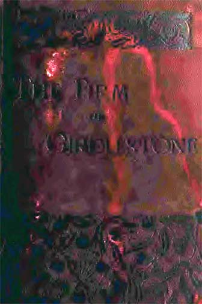

At four o'clock Mr. Girdlestone stepped into the Bedsworth telegraph office and wired his short message. It ran thus: "Case hopeless. Come on to-morrow with a doctor." On receipt of this he knew by their agreement that his son would come down, bringing with him the man of violence whom he had spoken of at their last interview. There was nothing for it now but that his ward should die. If he delayed longer, the crash might come before her money was available, and then how vain all regrets would be.

It seemed to him that there was very little risk in the matter. The girl had had no communication with any one. Even of those around her, Mrs. Jorrocks was in her dotage, Rebecca Taylforth was staunch and true, and Stevens knew nothing. Every one on the country side had heard of the invalid young lady at the Priory. Who would be surprised to hear that she had passed away? He dare not call in any local medical man, but his inventive brain had overcome the difficulty, and had hit upon a device by which he might defy both doctors and coroner. If all went as he had planned it, it was difficult to see any chance of detection. In the case of a poorer man the fact that the girl's money reverted to him might arouse suspicion, but he rightly argued that with his great reputation no one would ever dream that such a consideration could have weight with him.

Having sent the telegram off, and so taken a final step, John Girdlestone felt more at his ease. He was proud of his own energy and decision. As he walked very pompously and gravely down the village street, his heart glowed within him at the thought of the long struggle which he had maintained against misfortune. He passed over in his mind all the successive borrowings and speculations and makeshifts and ruses which the firm had resorted to. Yet, in spite of every danger and difficulty, it still held up its head with the best, and would weather the storm at last. He reflected proudly that there was no other man in the City who would have had the dogged tenacity and the grim resolution which he had displayed during the last twelve months. "If ever any one should put it all in a book," he said to himself, "there are few who would believe it possible. It is not by my own strength that I have done it."

The man had no consciousness of blasphemy in him as he revolved this thought in his mind. He was as thoroughly in earnest as were any of those religious fanatics who, throughout history, have burned, sacked, and destroyed, committing every sin under heaven in the name of a God of peace and of mercy.

When he was half-way to the Priory he met a small pony-carriage, which was rattling towards Bedsworth at a great pace, driven by a good-looking middle-aged lady with a small page by her side. The merchant encountered this equipage in a narrow country lane without a footpath, and as it approached him he could not help observing that the lady wore an indignant and gloomy look upon her features which was out of keeping with their general contour. Her forehead was contracted into a very decided frown, and her lips were gathered into what might be described as a negative smile. Girdlestone stood aside to let her pass, but the lady, by a sudden twitch of her right-hand rein, brought the wheels across in so sudden a manner that they were within an ace of going over his toes. He only saved himself by springing back into a gap of the hedge. As it was, he found on looking down that his pearl grey trousers were covered with flakes of wet mud. What made the incident more perplexing was that both the middle-aged lady and the page laughed very heartily as they rattled away to the village. The merchant proceeded on his way marvelling in his heart at the uncharitableness and innate wickedness of unregenerated human nature.

Good Mrs. Scully little dreamed of the urgency of the case. Had she seen the telegram which John Girdlestone had just despatched, it is conceivable that she might have read between the words, and by acting more promptly have prevented a terrible crime. As a matter of fact, with all her sympathy the worthy woman had taken a large part of Kate's story with the proverbial grain of salt. It seemed to her to be incredible and impossible that in this nineteenth century such a thing as deliberate and carefully planned murder should occur in Christian England. That these things occur in the abstract we are ready to admit, but we find it very difficult to realize that they may come within the horizon of our own experience. Hence Mrs. Scully set no importance upon Kate's fears for her life, and put them down to the excited state of the girl's imagination. She did consider it, however, to be a very iniquitous and unjustifiable thing that a young girl should be cooped up and separated from all the world in such a very dreary place of seclusion as the Priory. This consideration and nothing more serious had set that look of wrath upon her pleasant face, and had stirred her up to frustrate Girdlestone and to communicate with Kate's friends.

Her intention had been to telegraph to London, but as she drove to Bedsworth she bethought her how impossible it would be for her within the limits of a telegram to explain to her satisfaction all that she wanted to express. A letter, she reflected, would, if posted now, reach the major by the first post on Saturday morning. It would simply mean a few hours' delay in the taking of steps to relieve Kate, and what difference could a few hours more or less make to the girl. She determined, therefore, that she would write to the major, explaining all the circumstances, and leave it to him what course of action should be pursued.

Mrs. Scully was well known at the post office, and they quickly accommodated her with the requisites for correspondence. Within a quarter of an hour she had written, sealed, stamped, and posted the following epistle:—

> "DEAREST TOBY,
> 
> "I am afraid you must find your period of probation very slow. Poor boy! what does he do? No billiards, no cards, no betting— how does he manage to get through the day at all? Smokes, I suppose, and looks out of the window, and tells all his grievances to Mr. Von Baumser. Aren't you sorry that ever you made the acquaintance of Morrison's second floor front? Poor Toby!
> 
> "Who do you think I have come across down here? No less a person than that Miss Harston who was Girdlestone's ward. You used to talk about her, I remember, and indeed you were a great admirer of hers. You would be surprised if you saw her now, so thin and worn and pale. Still her face is very sweet and pretty, so I won't deny your good taste—how could I after you have paid your addresses to me?
> 
> "Her guardian has brought her down here and has locked her up in a great bleak house called the Priory. She has no one to speak to, and is not allowed to write letters. She seemed to be heart-broken because none of her friends know where she is, and she fears that they may imagine that she has willingly deserted them. Of course, by her friends she means that curly-headed Mr. Dimsdale that you spoke of. The poor girl is in a very low nervous state, and told me over the wall of the park that she feared her guardian had designs on her life. I can hardly believe that, but I do think that she is far from well, and that it is enough to drive her mad to coop her up like that. We must get her out somehow or another. I suppose that her guardian is within his rights, and that it is not a police matter. You must consider what must be done, and let young Dimsdale know if you think best. He will want to come down to see her, no doubt, and if Toby were to come too I should not be sorry.
> 
> "I should have telegraphed about it, but I could not explain myself sufficiently. I assure you that the poor girl is in a very bad way, and we can't be too energetic in what we do. It was very sad to hear the positive manner in which she declared that her guardian would murder her, though she did not attempt to give any reason why he should commit such a terrible crime. We saw a horrid one-eyed man at the gate, who appeared to be on guard to prevent any one from coming out or in. On our way to Bedsworth we met no less a person than the great Mr. Girdlestone himself, and we actually drove so clumsily that we splashed him all over with mud. Wasn't that a very sad and unaccountable thing? I fancy I see Toby smiling over that.
> 
> "Good-bye, my dear lad. Be as good as you can. I know you've got rather out of the way of it, but practice works wonders.
> 
> "Ever yours, "LAVINIA SCULLY."

It happened that on the morning on which this missive came to Kennedy Place, Von Baumser had not gone to the City. The major had just performed his toilet and was marching up and down with a cigarette in his mouth and the United Service Gazette in his hand, descanting fluently, as is the habit of old soldiers, on the favouritism of the Horse Guards and the deterioration of the service.

"Look at this fellow Carmoichael!" he cried excitedly, slapping the paper with one, hand, while he crumpled it up with the other. "They've made him lieutinant-gineral! The demndest booby in the regiment, sir! A fellow who's seen no service and never heard a shot fired in anger. They promoted him on the stringth of a sham fight, bedad! He commanded a definding force operating along the Thames and opposing an invading army that was advancing from Guildford. Did iver ye hear such infernal nonsense in your life? And there's Stares, and Knight, and Underwood, and a dozen more I could mintion, that have volunteered for everything since the Sikh war of '46, all neglicted, sir—neglicted! The British Army is going straight to the divil."

"Dat's a very bad look-out for the devil," said Von Baumser, filling up a cup of coffee.

The major continued to stride angrily about the room. "That's why we niver have a satisfactory campaign with a European foe," he broke out. "Our success is always half and half, and leads to nothing. Yet we have the finest raw material and the greatest individual fighting power and divilment of any army in the world."

"Always, of course, not counting de army of his most graceworthy majesty de Emperor William," said Von Baumser, with his mouth full of toast. "Here is de girl mit a letter. Let us hope dat it is my Frankfort money."

"Two to one it's for me."

"Ah, he must not bet!" cried Von Baumser, with upraised finger. "You have right, though. It is for you, and from de proper quarter too, I think."

It was the letter which we have already quoted. The major broke the seal and read it over very carefully, after which he read it again. Von Baumser, watching him across the table, saw a very anxious and troubled look upon his ruddy face.

"I hope dere is nothing wrong mit my good vriend, Madame Scully?" he remarked at last.

"No, nothing wrong with her. There is with some one else, though;" and with that he read to his companion all that part of his letter which referred to Miss Harston.

"Dat is no joke at all," the German remarked; and the two sat for some little time lost in thought, the major with the letter still lying open upon his knee.

"What d'ye think of it?" he asked at last.

"I think dat it is a more bad thing than the good madame seems to think. I think dat if Miss Harston says dat Herr Girdlestone intends to kill her, it is very likely dat he has dat intention"

"Ged, he's not a man to stick at troifles," the major said, rubbing his chin reflectively. "Here's a nice kettle of fish! What the deuce could cause him to do such a thing?"

"Money, of course. I have told you, my good vriend, dat since a year de firm has been in a very bad way indeed. It is not generally known, but I know it, and so do others. Dis girl, I have heard, has money which would come to de old man in case of her death. It is as plain as de vingers on my hand."

"Be George, the thing looks very ugly!" said the major, pacing up and down the room. "I believe that fellow and his beauty of a son are game for anything. Lavinia takes the mather too lightly. Fancy any one being such a scounthrel as to lay a hand on that dear girl, though. Ged, Baumser, it makes ivery drop of blood in me body tingle in me veins!"

"My dear vriend," Von Baumser answered, "it is very good of your blood for to tingle, but I do not see how dat will help the mees. Let us be practical, and make up our brains what we should do."

"I must find young Dimsdale at once. He has a right to know."

"Yes, I should find him. Dere is no doubt that you and he should at once start off for dis place. I know dat young man. Dere vill be no holding him at all when he has heard of it. You must go too, to prevent him from doing dummheiten, and also because good Madame Scully has said so in her letter."

"Certainly. We shall go down togither. One of us will manage to see the young lady and find out if she requoires assistance. Bedad, if she does, she shall have it, guardian or no guardian. If we don't whip her out in a brace of shakes me name's not Clutterbuck."

"You must remember," remarked Baumser, "dat dese people are desperate. If dey intend to murder a voman dey vould certainly not stick at a man or two men. You have no knowledge of how many dere may be. Dere is certainly Herr Girdlestone and his son and de man mit de eye, but madame knows not how many may be at de house. Remember also dat de police are not on your side, but rather against you, for as yet dere is no evidence dat any crime is intentioned. Ven you think of all dis I am sure dat you vill agree with me dat it would be vell to take mit you two or tree men dat would stick by you through thin and broad."

The major was so busy in making his preparations for departure that he could only signify by a nod that he agreed with his friend's remarks. "What men could I git?" he asked.

"Dere is I myself," said the German, counting upon his big red fingers, "and dere are some of our society who would very gladly come on such an errand, and are men who are altogether to be relied upon. Dere is little Fritz Bulow, of Kiel, and a Russian man whose name I disremember, but he is a good man. He vas a Nihilist at Odessa, and is sentenced to death suppose they could him catch. Dere are others as good, but it might take me time to find dem. Dese two I can very easily get. Dey are living together, and have neither of dem nothing to do."

"Bring them, then," said the major. "Git a cab and run them down to Waterloo Station. That's the one for Bedsworth. I'll bring Dimsdale down with me and mate you there. In me opinion there's no time to be lost."

The major was ready to start, so Von Baumser threw on his coat and hat, and picked out a thick stick from a rack in the corner. "We may need something of de sort," he said.

"I have me derringer," the soldier answered. They left the house together, and Von Baumser drove off to the East End, where his political friends resided. The major called a cab and rattled away to Phillimore Gardens and thence to the office, without being able to find the man of whom he was in search. He then rushed down the Strand as quickly as he could, intending to catch the next train and go alone, but on his way to Waterloo Station he fell in with Tom Dimsdale, as recorded in a preceding chapter.

The letter was a thunderbolt to Tom, In his worst dreams he had never imagined anything so dark as this. He hurried back to the station at such a pace that the poor major was reduced to a most asthmatical and wheezy condition. He trotted along pluckily, however, and as he went heard the account of Tom's adventures in the morning and of the departure of Ezra Girdlestone and of his red-bearded companion. The major's face grew more anxious still when he heard of it. "Pray God we may not be too late!" he panted.
