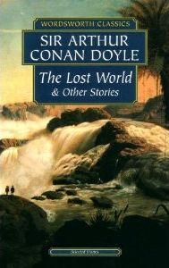

The Lost World is a novel released in 1912 by [Sir Arthur Conan Doyle](/sirconandoyle/biography-of-sir-arthur-conan-doyle/) concerning an expedition to a plateau in the Amazon basin of South America where prehistoric animals (dinosaurs and other extinct creatures) still survive. It was originally published serially in the popular Strand Magazine during the months of April 1912-November 1912. The character of Professor Challenger was introduced in this book. The novel also describes a war between Native Americans and a vicious tribe of ape-like creatures.

> I have wrought my simple plan If I give one hour of joy To the boy who's half a man, Or the man who's half a boy.

### Foreword

Mr. E. D. Malone desires to state that both the injunction for restraint and the libel action have been withdrawn unreservedly by Professor G. E. Challenger, who, being satisfied that no criticism or comment in this book is meant in an offensive spirit, has guaranteed that he will place no impediment to its publication and circulation. 

### Table of Contents

Chapter 1 - [THERE ARE HEROISMS ALL ROUND US](/sirconandoyle/there-are-heroisms-all-round-us/%20%22The%20Lost%20World:%20Chapter%201%20%E2%80%93%20There%20Are%20Heroisms%20All%20Round%20Us%22/)

Chapter 2 - [TRY YOUR LUCK WITH PROFESSOR CHALLENGER](/sirconandoyle/try-your-luck-with-professor-challenger/%20%22The%20Lost%20World:%20Chapter%202%20%E2%80%93%20Try%20your%20luck%20with%20Professor%20Challenger%22/)

Chapter 3 - [HE IS A PERFECTLY IMPOSSIBLE PERSON](/sirconandoyle/he-is-a-perfectly-impossible-person/%20%22The%20Lost%20World:%20Chapter%203%20%E2%80%93%20He%20is%20a%20Perfectly%20Impossible%20Person%22/)

Chapter 4 - [IT'S JUST THE VERY BIGGEST THING IN THE WORLD](/sirconandoyle/its-just-the-very-biggest-thing-in-the-world/%20%22The%20Lost%20World:%20Chapter%204%20%E2%80%93%20It%E2%80%99s%20just%20the%20very%20biggest%20thing%20in%20the%20World%22/)

Chapter 5 - [QUESTION!](/sirconandoyle/lw-question/%20%22The%20Lost%20World:%20Chapter%205%20%E2%80%93%20Question!%22/)

Chapter 6 - [I WAS THE FLAIL OF THE LORD](/sirconandoyle/i-was-the-flail-of-the-lord/%20%22The%20Lost%20World:%20Chapter%206%20%E2%80%93%20I%20was%20the%20Flail%20of%20the%20Lord%22/)

Chapter 7 - [TOMORROW WE DISAPPEAR INTO THE UNKNOWN](/sirconandoyle/tomorrow-we-disappear-into-the-unknown/%20%22The%20Lost%20World:%20Chapter%207%20%E2%80%93%20Tomorrow%20we%20disappear%20into%20the%20Unknown%22/)

Chapter 8 - [THE OUTLYING PICKETS OF THE NEW WORLD](/sirconandoyle/the-outlying-pickets-of-the-new-world/%20%22The%20Lost%20World:%20Chapter%208%20%E2%80%93%20The%20Outlying%20Pickets%20of%20the%20New%20World%22/)

Chapter 9 - [WHO COULD HAVE FORESEEN IT?](/sirconandoyle/who-could-have-foreseen-it/%20%22The%20Lost%20World:%20Chapter%209%20%E2%80%93%20Who%20could%20have%20foreseen%20it/)

Chapter 10 - [THE MOST WONDERFUL THINGS HAVE HAPPENED](/sirconandoyle/the-most-wonderful-things-have-happened/%20%22The%20Lost%20World:%20Chapter%2010%20%E2%80%93%20The%20most%20Wonderful%20Things%20have%20Happened%22/)

Chapter 11 - [FOR ONCE I WAS THE HERO](/sirconandoyle/for-once-i-was-the-hero/%20%22The%20Lost%20World:%20Chapter%2011%20%E2%80%93%20For%20Once%20I%20was%20the%20Hero%22/)

Chapter 12 - [IT WAS DREADFUL IN THE FOREST](/sirconandoyle/it-was-dreadful-in-the-forest/%20%22The%20Lost%20World:%20Chapter%2012%20%E2%80%93%20It%20was%20dreadful%20in%20the%20Forest%22/)

Chapter 13 - [A SIGHT I SHALL NEVER FORGET](/sirconandoyle/a-sight-which-i-shall-never-forget/%20%22The%20Lost%20World:%20Chapter%2013%20%E2%80%93%20A%20Sight%20which%20I%20shall%20Never%20Forget%22/)

Chapter 14 - [THOSE WERE THE REAL CONQUESTS](/sirconandoyle/real-conquests/%20%22The%20Lost%20World:%20Chapter%2014%20%E2%80%93%20Those%20were%20the%20Real%20Conquests%22/)

Chapter 15 - [OUR EYES HAVE SEEN GREAT WONDERS](/sirconandoyle/eyes-great-wonders/%20%22The%20Lost%20World:%20Chapter%2015%20%E2%80%93%20Our%20Eyes%20have%20seen%20Great%20Wonders%22/)

Chapter 16 - [A PROCESSION! A PROCESSION!](/sirconandoyle/procession-procession/%20%22The%20Lost%20World:%20Chapter%2016%20%E2%80%93%20A%20Procession!%20A%20Procession!%22/)
