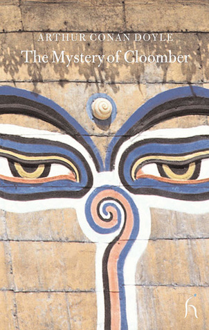

The Mystery of Cloomber is a novel by British author Sir Arthur Conan Doyle. It is narrated by John Fothergill West, a Scot who has moved with his family from Edinburgh to Wigtownshire to care for the estate of his father's half brother, William Farintosh. It was first published in 1889.

### Table of Contents

CHAPTER I. [THE HEGIRA OF THE WESTS FROM EDINBURGH](/novels/mystery-of-cloomber/hegira-wests-edinburgh/)

CHAPTER II. [OF THE STRANGE MANNER IN WHICH A TENANT CAME TO CLOOMBER](/novels/mystery-of-cloomber/strange-manner-tenant-cloomber/)

CHAPTER III. [OF OUR FURTHER ACQUAINTANCE WITH MAJOR-GENERAL J. B.HEATHERSTONE](/novels/mystery-of-cloomber/acquaintance-major-general-j-b-heatherstone/)

CHAPTER IV. [OF A YOUNG MAN WITH A GREY HEAD](/novels/mystery-of-cloomber/young-man-grey-head/)

CHAPTER V. [HOW FOUR OF US CAME TO BE UNDER THE SHADOW OF CLOOMBER](/novels/mystery-of-cloomber/shadow-cloomber/)

CHAPTER VI. [HOW I CAME TO BE ENLISTED AS ONE OF THE GARRISON OF CLOOMBER](/novels/mystery-of-cloomber/enlisted-garrison-cloomber/)

CHAPTER VII. [OF CORPORAL RUFUS SMITH AND HIS COMING TO CLOOMBER](/novels/mystery-of-cloomber/corporal-rufus-smith-coming-cloomber/)

CHAPTER VIII. [STATEMENT OF ISRAEL STAKES](/novels/mystery-of-cloomber/statement-israel-stakes/)

CHAPTER IX. [NARRATIVE OF JOHN EASTERLING, F.R.C.P.EDIN.](/novels/mystery-of-cloomber/narrative-john-easterling-f-r-c-p-edin/)

CHAPTER X. [OF THE LETTER WHICH CAME FROM THE HALL](/novels/mystery-of-cloomber/letter-hall/)

CHAPTER XI. [OF THE CASTING AWAY OF THE BARQUE "BELINDA"](/novels/mystery-of-cloomber/casting-barque-belinda/)

CHAPTER XII. [OF THE THREE FOREIGN MEN UPON THE COAST](/novels/mystery-of-cloomber/foreign-men-coast/)

CHAPTER XIII. [IN WHICH I SEE THAT WHICH HAS BEEN SEEN BY FEW](/novels/mystery-of-cloomber/in-which-i-see-that-which-has-been-seen-by-few/)

CHAPTER XIV. [OF THE VISITOR WHO RAN DOWN THE ROAD IN THE NIGHT-TIME](/novels/mystery-of-cloomber/visitor-ran-road-night-time/)

CHAPTER XV. [THE DAY-BOOK OF JOHN BERTHIER HEATHERSTONE](/novels/mystery-of-cloomber/day-book-john-berthier-heatherstone/)

CHAPTER XVI. [AT THE HOLE OF CREE](/novels/mystery-of-cloomber/hole-cree/)
