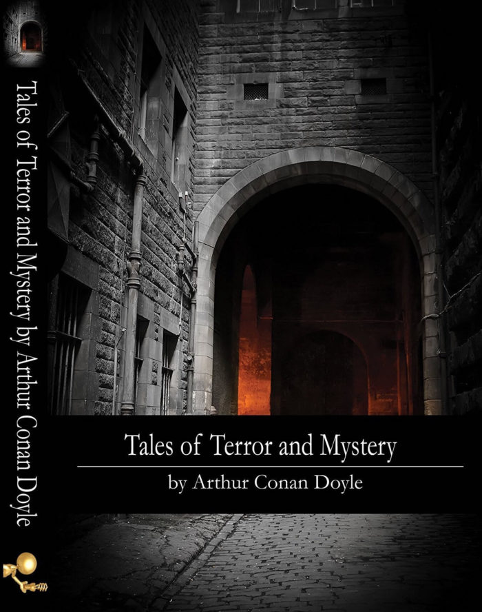

Tales of Terror and Mystery is a collection of 12 stories written by Sir Arthur Conan Doyle in 1923. In some of the stories in “Tales of Terror and Mystery”, a suppressed uneasiness gradually builds up and evolves into sheer terror. In others, the story line unexpectedly changes and comes to a horrific conclusion. All stories definitely promise you an entire world of intriguing characters written in Sir Arthur Conan Doyle's typical genius style.

## Tales of Terror

[The Horror of the Heights](/novels/tales-of-terror-and-mystery/the-horror-of-the-heights/) [The Leather Funnel](/novels/tales-of-terror-and-mystery/the-leather-funnel/) [The New Catacomb](/novels/tales-of-terror-and-mystery/the-new-catacomb/) [The Case of Lady Sannox](/novels/tales-of-terror-and-mystery/case-lady-sannox/) [The Terror of Blue John Gap](/novels/tales-of-terror-and-mystery/terror-blue-john-gap/) [The Brazilian Cat](/novels/tales-of-terror-and-mystery/the-brazilian-cat/)

## Tales of Mystery

[The Lost Special](/novels/tales-of-terror-and-mystery/the-lost-special/) [The Beetle-Hunter](/novels/tales-of-terror-and-mystery/the-beetle-hunter/) [The Man with the Watches](/novels/tales-of-terror-and-mystery/the-man-with-the-watches/) [The Japanned Box](/novels/tales-of-terror-and-mystery/the-japanned-box/) [The Black Doctor](/novels/tales-of-terror-and-mystery/black-doctor/) [The Jew's Breastplate](/novels/tales-of-terror-and-mystery/jews-breastplate/)

Get this on your Kindle from [Amazon.co.uk](http://amzn.to/2oPIHX9) | [Amazon.com](http://amzn.to/2nvbXCE)
